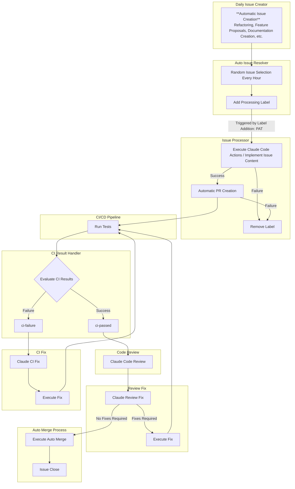
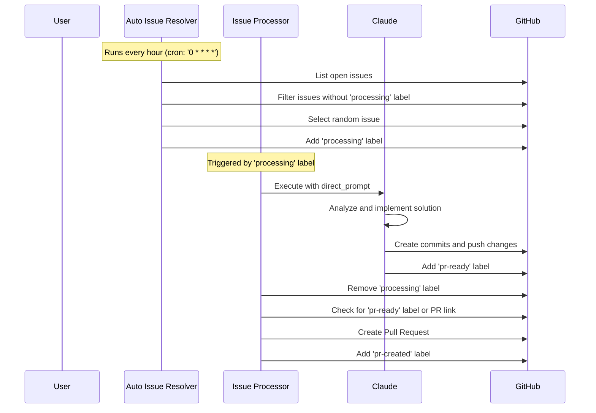
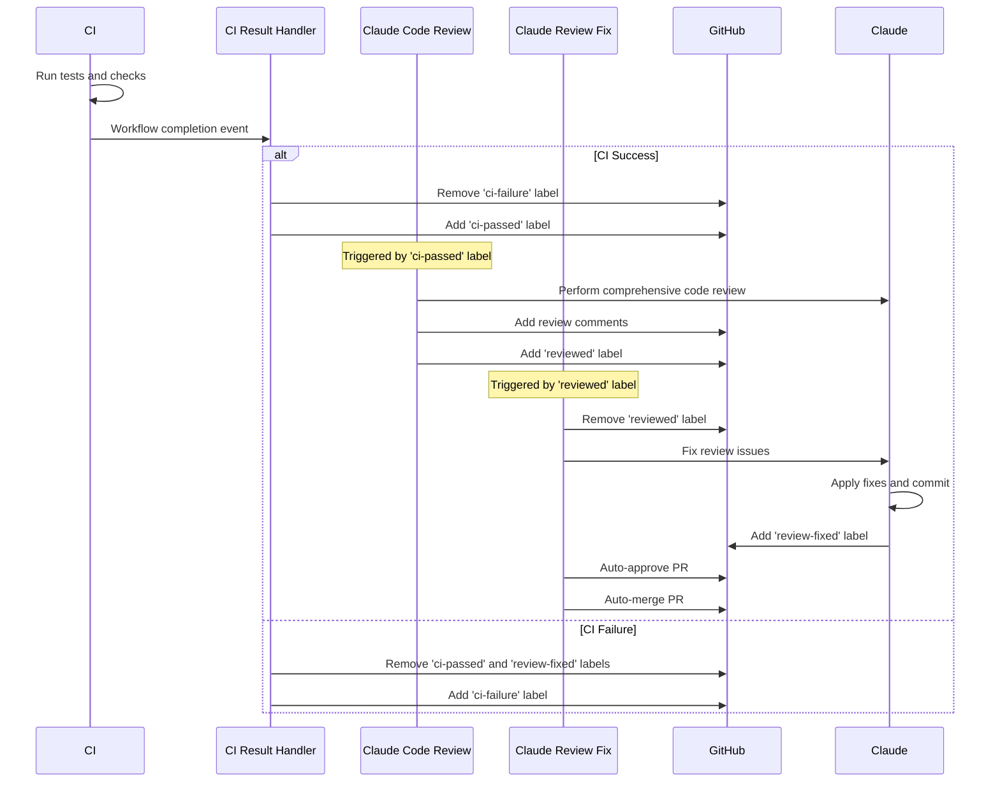
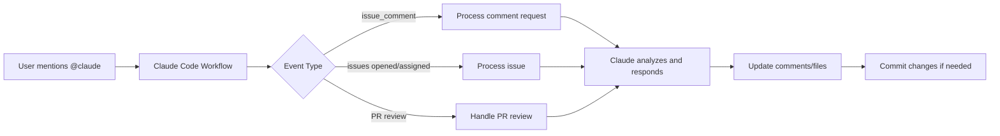
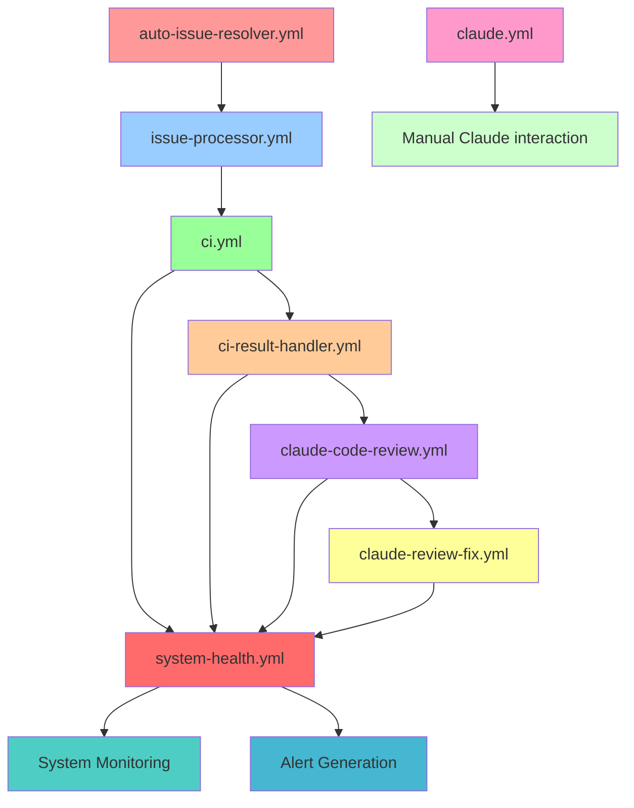

# Claude Code Auto Workflows

[](https://github.com/azumag/cca-auto-workflows/issues)
[](https://github.com/azumag/cca-auto-workflows/pulls)
[](LICENSE)
[](https://claude.ai/code)

A comprehensive GitHub Actions workflow system that automates issue processing, code review, and pull request management using Claude Code.

> **⚡ Fully Automated Development Workflow**: This repository demonstrates a complete automation pipeline where issues are automatically selected, processed by Claude Code, converted to pull requests, reviewed, and merged without manual intervention.

## Table of Contents
- [Workflow Overview](#workflow-overview)
- [Detailed Workflow Processes](#detailed-workflow-processes)
- [Setup Instructions](#setup-instructions)
- [Required Labels](#required-labels)
- [Required Permissions](#required-permissions)
- [GitHub App Configuration](#github-app-configuration)
- [Personal Access Token Configuration](#personal-access-token-configuration)
- [Workflow Files](#workflow-files)

## Workflow Overview

This repository implements an automated development workflow that processes issues, creates pull requests, runs CI checks, performs code reviews, and auto-merges approved changes.



## Detailed Workflow Processes

### 1. Issue Processing Flow



### 2. Code Review and Merge Flow



### 3. Manual Claude Interaction Flow



## Setup Instructions

### Quick Setup Sequence
1. **Install Claude Code CLI**: `npm install -g @anthropic-ai/claude-code`
2. **Setup OAuth**: Run `claude setup-token` to get your OAuth token
3. **Install GitHub App**: Run `/install-github-app` in Claude Code CLI
4. **Create Custom GitHub App** (for advanced permissions):
   - Follow the detailed GitHub App Configuration section below
   - Set `APP_ID` and `APP_PRIVATE_KEY` in repository secrets
5. **Create Personal Access Token** with required scopes
6. **Add Repository Secrets**:
   - `PERSONAL_ACCESS_TOKEN`: Your PAT
   - `CLAUDE_CODE_OAUTH_TOKEN`: From step 2
   - `APP_ID` & `APP_PRIVATE_KEY`: From step 4
7. **Create Labels**: Run the label creation commands provided below
8. **Copy Workflow Files**: Add the workflow files from this repository to `.github/workflows/`

> **⚠️ Important**: Complete all steps in order. Missing secrets or labels will cause workflow failures.

## Required Labels

The system uses the following labels to track workflow state:

### Issue Processing Labels
| Label | Purpose | Added By |
|-------|---------|----------|
| `processing` | Issue is being processed by Claude | auto-issue-resolver.yml |
| `pr-ready` | Implementation complete, ready for PR creation | Claude Code |
| `pr-created` | PR has been created for this issue | issue-processor.yml |
| `resolved` | Issue has been resolved and closed | Manual/Auto |

### PR Review Labels
| Label | Purpose | Added By |
|-------|---------|----------|
| `reviewed` | PR has been reviewed and needs fixes | claude-code-review.yml |
| `review-fixed` | PR fixes completed, ready for merge | claude-review-fix.yml |

### CI/CD Status Labels
| Label | Purpose | Added By |
|-------|---------|----------|
| `ci-failure` | CI checks have failed | ci-result-handler.yml |
| `ci-passed` | CI checks have passed | ci-result-handler.yml |

### Label Creation Command
```bash
# Create all required labels at once
gh label create "processing" --color "FFA500" --description "Issue is being processed by Claude"
gh label create "pr-ready" --color "0052CC" --description "Implementation complete, ready for PR creation"
gh label create "pr-created" --color "0E8A16" --description "PR has been created for this issue"
gh label create "resolved" --color "6F42C1" --description "Issue has been resolved and closed"
gh label create "reviewed" --color "D93F0B" --description "PR has been reviewed and needs fixes"
gh label create "review-fixed" --color "0052CC" --description "PR fixes completed, ready for merge"
gh label create "ci-failure" --color "D93F0B" --description "CI checks have failed"
gh label create "ci-passed" --color "0E8A16" --description "CI checks have passed"
```

## Required Permissions

### GitHub App Permissions
The GitHub App requires the following permissions:

#### Repository Permissions
- **Contents**: `write` - Read and write repository contents
- **Issues**: `write` - Create, edit, and manage issues
- **Pull Requests**: `write` - Create, edit, and manage pull requests
- **Actions**: `read` - Read workflow run results for CI status
- **Metadata**: `read` - Read repository metadata

#### Account Permissions
- **Email addresses**: `read` - Access user email for commits

### Workflow Permissions
Each workflow requires specific permissions:

```yaml
permissions:
  contents: write        # For code changes and commits
  issues: write         # For issue management and labeling
  pull-requests: write  # For PR creation and management
  actions: read         # For reading CI results
  id-token: write       # For authentication
```

## GitHub App Configuration

### 1. Create GitHub App
1. Go to GitHub Settings > Developer Settings > GitHub Apps
2. Click "New GitHub App"
3. Fill in the app details:
   - **App name**: `claude-code-automation` (or your preferred name)
   - **Homepage URL**: Your repository URL
   - **Webhook URL**: Leave blank (not needed for this setup)

### 2. Set Permissions
Configure the following permissions:

#### Repository permissions:
- Contents: Read and write
- Issues: Read and write
- Pull requests: Read and write
- Actions: Read
- Metadata: Read

#### Subscribe to events:
- Issues
- Pull requests
- Push

### 3. Generate Private Key
1. Scroll down to "Private keys" section
2. Click "Generate a private key"
3. Download the `.pem` file

### 4. Install App
1. Go to "Install App" tab
2. Install on your account/organization
3. Select repositories or choose "All repositories"

### 5. Get App ID
- Find your App ID on the app settings page

## Personal Access Token Configuration

### Required Scopes
Create a Personal Access Token with the following scopes:

- `repo` (Full control of private repositories)
  - `repo:status` - Access commit status
  - `repo_deployment` - Access deployment status
  - `public_repo` - Access public repositories
- `workflow` - Update GitHub Action workflows
- `write:packages` - Upload packages to GitHub Package Registry (optional)
- `read:packages` - Download packages from GitHub Package Registry (optional)

> **Security Note**: For production environments, consider using fine-grained personal access tokens with minimal required permissions.

### Token Creation Steps
1. Go to GitHub Settings > Developer Settings > Personal Access Tokens > Tokens (classic)
2. Click "Generate new token (classic)"
3. Select the required scopes listed above
4. Set expiration (recommend 90 days or no expiration for automation)
5. Generate token and copy it immediately

## Repository Secrets Configuration

Add the following secrets to your repository:

| Secret Name | Value | Description |
|-------------|-------|-------------|
| `APP_ID` | Your GitHub App ID | Found on GitHub App settings page |
| `APP_PRIVATE_KEY` | Contents of downloaded `.pem` file | GitHub App private key |
| `PERSONAL_ACCESS_TOKEN` | Your PAT | Personal Access Token with required scopes |
| `CLAUDE_CODE_OAUTH_TOKEN` | Your Claude Code OAuth token | Obtained from Claude Code CLI |

### Setting Secrets
```bash
# Using GitHub CLI
gh secret set APP_ID --body "123456"
gh secret set APP_PRIVATE_KEY --body "$(cat path/to/your-app.pem)"
gh secret set PERSONAL_ACCESS_TOKEN --body "ghp_your_token_here"
gh secret set CLAUDE_CODE_OAUTH_TOKEN --body "your_claude_oauth_token"
```

## Troubleshooting Guide

If you encounter issues with the automated workflows, use this decision tree to diagnose and resolve common problems:

**See also:**
- [**Configuration Guide**](docs/CONFIGURATION.md) - Detailed configuration options and validation procedures
- [**Performance Tuning Guide**](docs/PERFORMANCE_TUNING.md) - Comprehensive performance optimization strategies
- [**Advanced Configuration Patterns**](docs/ADVANCED.md) - Complex configuration scenarios and troubleshooting

```mermaid
flowchart TD
    ISSUE([Workflow Issue]) --> TYPE{What type of issue?}
    
    TYPE -->|Workflow Not Triggering| TRIGGER{Check trigger conditions}
    TYPE -->|Workflow Failing| FAILURE{Check failure type}
    TYPE -->|Claude Code Issues| CLAUDE{Check Claude Code setup}
    TYPE -->|Permission Issues| PERMISSION{Check permissions}
    
    %% Trigger Issues
    TRIGGER -->|Labels Missing| LABEL_CHECK[**🕐 Estimated Time: 2-5 minutes**<br/><br/>Verify required labels exist:<br/>• claude<br/>• processing<br/>• ci-passed, ci-failure<br/>Run: ./scripts/create-labels.sh<br/><br/>**Example**: Issue stuck with "@claude help" comment<br/>→ Missing 'claude' label prevents workflow trigger<br/>→ Solution: gh issue edit 123 --add-label claude<br/><br/>**See also**: [Configuration Guide - Label Management](docs/CONFIGURATION.md#label-management)]
    TRIGGER -->|Wrong Event Type| EVENT_CHECK[**🕐 Estimated Time: 5-10 minutes**<br/><br/>Check workflow triggers:<br/>• Issues: labeled, opened<br/>• PRs: opened, synchronize<br/>• Schedule: cron expressions<br/><br/>**Example**: Claude not responding to new issues<br/>→ Workflow only triggers on 'labeled' not 'opened'<br/>→ Solution: Add 'opened' to workflow triggers]
    TRIGGER -->|Branch Protection| BRANCH_CHECK[**🕐 Estimated Time: 10-15 minutes**<br/><br/>Check branch protection rules<br/>Verify workflow can run on target branch<br/>Check required status checks<br/><br/>**Example**: "Required status check missing" error<br/>→ Branch protection requires 'ci' check but it's named 'tests'<br/>→ Solution: Update branch protection rule names]
    
    %% Failure Issues
    FAILURE -->|Authentication Errors| AUTH_FAILURE[**🕐 Estimated Time: 10-20 minutes**<br/><br/>Check GitHub token:<br/>• Valid and not expired<br/>• Correct permissions<br/>• Organization access if needed<br/><br/>**Example**: "Error: HTTP 401 Unauthorized"<br/>→ GITHUB_TOKEN expired after 90 days<br/>→ Solution: Regenerate PAT and update secrets<br/><br/>**Example**: "Error: Resource not accessible by token"<br/>→ Token missing 'workflow' scope for GitHub Actions<br/>→ Solution: Add workflow scope to token]
    FAILURE -->|Rate Limiting| RATE_FAILURE[**🕐 Estimated Time: 15-30 minutes**<br/><br/>Check API rate limits:<br/>• Run: gh api rate_limit<br/>• Use GitHub App token for higher limits<br/>• Implement request throttling<br/><br/>**Example**: "Error: API rate limit exceeded"<br/>→ 4,800/5,000 requests used in last hour<br/>→ Solution: Increase CACHE_TTL from 300 to 1800 seconds<br/><br/>**Example**: Workflows failing at peak times<br/>→ Multiple repos sharing same PAT hitting limits<br/>→ Solution: Switch to GitHub App (15,000 req/hr limit)<br/><br/>**See also**: [Performance Tuning - Rate Limit Management](docs/PERFORMANCE_TUNING.md#rate-limit-management)]
    FAILURE -->|Script Errors| SCRIPT_FAILURE[**🕐 Estimated Time: 5-15 minutes**<br/><br/>Check script execution:<br/>• Review workflow logs<br/>• Check script permissions<br/>• Verify dependencies installed<br/><br/>**Example**: "./scripts/analyze.sh: Permission denied"<br/>→ Script lost execute permissions after git clone<br/>→ Solution: chmod +x scripts/*.sh<br/><br/>**Example**: "jq: command not found"<br/>→ Missing dependency on GitHub Actions runner<br/>→ Solution: Add 'sudo apt-get install jq' to workflow]
    
    %% Claude Code Issues
    CLAUDE -->|Claude Not Responding| CLAUDE_RESPONSE[**🕐 Estimated Time: 10-25 minutes**<br/><br/>Check Claude Code setup:<br/>• Verify anthropics/claude-code-action version<br/>• Check issue content format<br/>• Review Claude Code logs<br/><br/>**Example**: Claude comment shows "working..." but never updates<br/>→ CLAUDE_CODE_OAUTH_TOKEN missing from secrets<br/>→ Solution: Add OAuth token to repository secrets<br/><br/>**Example**: "Error: Forbidden" in Claude workflow logs<br/>→ Using old anthropics/claude-code-action@v1<br/>→ Solution: Update to anthropics/claude-code-action@beta]
    CLAUDE -->|Invalid Instructions| CLAUDE_INSTRUCTIONS[**🕐 Estimated Time: 5-10 minutes**<br/><br/>Review issue content:<br/>• Clear and specific instructions<br/>• Proper formatting<br/>• Avoid ambiguous requests<br/><br/>**Example**: "@claude fix the bug" (too vague)<br/>→ Claude responds with "I need more specific details"<br/>→ Solution: "@claude fix the null pointer exception in UserService.java line 45"<br/><br/>**Example**: Mixing multiple unrelated requests in one comment<br/>→ Claude only addresses first request<br/>→ Solution: Create separate issues for each task]
    CLAUDE -->|Timeout Issues| CLAUDE_TIMEOUT[**🕐 Estimated Time: 20-45 minutes**<br/><br/>Check execution time:<br/>• Complex tasks may need more time<br/>• Break down large tasks<br/>• Review workflow timeout settings<br/><br/>**Example**: "Error: Job was cancelled" after 6 hours<br/>→ GitHub Actions default timeout is 6 hours<br/>→ Solution: Break large refactoring into smaller tasks<br/><br/>**Example**: Claude stops mid-task on complex implementations<br/>→ Task too large for single execution context<br/>→ Solution: Split into phases with explicit milestones<br/><br/>**See also**: [Performance Tuning - Workflow Optimization](docs/PERFORMANCE_TUNING.md#workflow-optimization)]
    
    %% Permission Issues
    PERMISSION -->|Repository Access| REPO_ACCESS[**🕐 Estimated Time: 15-30 minutes**<br/><br/>Check repository permissions:<br/>• Read/write access to repo<br/>• Actions execution permissions<br/>• Branch protection overrides<br/><br/>**Example**: "Error: Push to main branch blocked"<br/>→ Branch protection requires PR but Claude trying to push directly<br/>→ Solution: Configure Claude to create PRs instead<br/><br/>**Example**: "Error: Actions are disabled for this repository"<br/>→ Organization policy disabled GitHub Actions<br/>→ Solution: Request admin to enable Actions for repo]
    PERMISSION -->|Token Scope| TOKEN_SCOPE[**🕐 Estimated Time: 10-20 minutes**<br/><br/>Verify token scopes:<br/>• repo (full repository access)<br/>• workflow (GitHub Actions)<br/>• write:packages (if needed)<br/><br/>**Example**: "Error: Resource not accessible" when updating workflows<br/>→ PAT missing 'workflow' scope<br/>→ Solution: Regenerate token with workflow scope<br/><br/>**Example**: "Error: Insufficient privileges" on private repos<br/>→ Token has public_repo but not full repo scope<br/>→ Solution: Grant 'repo' scope for private repository access<br/><br/>**See also**: [Configuration Guide - GitHub-Specific Variables](docs/CONFIGURATION.md#github-specific-variables)]
    PERMISSION -->|Organization Policies| ORG_POLICY[**🕐 Estimated Time: 30-120 minutes**<br/><br/>Check organization settings:<br/>• Third-party application access<br/>• GitHub Actions permissions<br/>• API usage policies<br/><br/>**Example**: "Error: Third-party application access restricted"<br/>→ Organization blocked external OAuth apps<br/>→ Solution: Admin must whitelist Claude Code app<br/><br/>**Example**: Actions fail with "Runner not found"<br/>→ Organization requires self-hosted runners<br/>→ Solution: Configure workflow for self-hosted runners]
    
    %% Solutions
    LABEL_CHECK --> VERIFY{Test the fix}
    EVENT_CHECK --> VERIFY
    BRANCH_CHECK --> VERIFY
    AUTH_FAILURE --> VERIFY
    RATE_FAILURE --> VERIFY
    SCRIPT_FAILURE --> VERIFY
    CLAUDE_RESPONSE --> VERIFY
    CLAUDE_INSTRUCTIONS --> VERIFY  
    CLAUDE_TIMEOUT --> VERIFY
    REPO_ACCESS --> VERIFY
    TOKEN_SCOPE --> VERIFY
    ORG_POLICY --> VERIFY
    
    VERIFY -->|Fixed| SUCCESS([Issue Resolved ✅])
    VERIFY -->|Still Failing| DEBUG[Enable debug logging:<br/>Set ACTIONS_STEP_DEBUG=true<br/>Review detailed workflow logs<br/>Check GitHub Actions status page]
    
    DEBUG --> TYPE
    
    %% Styling
    style ISSUE fill:#ffebee
    style SUCCESS fill:#e8f5e8
    style TYPE fill:#e1f5fe
    style VERIFY fill:#f3e5f5
    style DEBUG fill:#fff3e0
```

## Workflow Files

### Core Workflows

| File | Purpose | Trigger |
|------|---------|---------|
| `.github/workflows/auto-issue-resolver.yml` | Automatically adds 'processing' label to random issues | Cron (hourly) |
| `.github/workflows/issue-processor.yml` | Processes issues with Claude and creates PRs | Label: 'processing' |
| `.github/workflows/claude.yml` | Main Claude Code integration | @claude mentions |
| `.github/workflows/ci.yml` | Enhanced CI with security scanning and quality checks | PR events, Push to main |
| `.github/workflows/ci-result-handler.yml` | Handles CI results and updates labels | CI workflow completion |
| `.github/workflows/claude-code-review.yml` | Automated code review with enhanced error handling | Label: 'ci-passed' |
| `.github/workflows/claude-review-fix.yml` | Handles review fixes and auto-merge | Label: 'reviewed' |
| `.github/workflows/claude-ci-fix.yml` | Automated CI failure fixes | Label: 'ci-failure' |
| `.github/workflows/daily-issue.yml` | Daily issue creation automation | Cron schedule |
| `.github/workflows/system-health.yml` | **New**: System health monitoring and alerting | Cron (every 6h), Manual |

### Workflow Dependencies



## Troubleshooting

### Common Issues

#### Workflow Not Triggering
- **Issue**: Claude doesn't respond to @claude mentions
- **Solution**: Check that the triggering user has write permissions to the repository
- **Check**: Verify `CLAUDE_CODE_OAUTH_TOKEN` is correctly set in repository secrets
- **Advanced Debugging**:
  ```bash
  # Check workflow run history
  gh run list --workflow=claude.yml --limit=10
  
  # Check specific run details
  gh run view <run-id> --log
  ```

#### Label Processing Issues
- **Issue**: Issues stuck in 'processing' state
- **Solution**: Check that all required labels are created in the repository
- **Command**: Use the label creation script provided in the setup section
- **Recovery**: Manually remove 'processing' label to reset: `gh issue edit <issue-number> --remove-label processing`

#### Permission Errors
- **Issue**: "Resource not accessible" errors in workflows
- **Solution**: Verify GitHub App has all required permissions listed in the setup
- **Check**: Ensure Personal Access Token has sufficient scopes
- **Diagnosis**:
  ```bash
  # Test GitHub token permissions
  gh api user
  gh api repos/:owner/:repo
  
  # Check repository settings
  gh repo view --json permissions
  ```

#### CI Integration Problems
- **Issue**: CI status not updating properly
- **Solution**: Check that `actions: read` permission is granted to workflows
- **Verify**: Ensure CI workflow names match those expected by the handlers
- **Monitor**: Use the new system health check workflow to track CI reliability

#### High API Usage Warnings
- **Issue**: GitHub API rate limit approaching
- **Solution**: 
  - Monitor usage with system health checks (automatic)
  - Implement request caching where possible
  - Consider GitHub App tokens for higher limits
  - Review workflow trigger frequency
- **Check Usage**: `gh api rate_limit`

#### Claude Code Execution Failures
- **Issue**: Claude Code workflows failing consistently
- **Diagnosis**:
  ```bash
  # Check Claude-specific workflows
  gh run list --workflow="Claude Code" --status=failure --limit=5
  
  # Verify OAuth token
  claude config
  ```
- **Solutions**:
  - Refresh Claude Code OAuth token
  - Check Claude API status
  - Review allowed_tools configurations
  - Verify custom instructions syntax

#### Security Scan Failures
- **Issue**: New security scanning jobs failing
- **Solution**: 
  - Check Trivy scanner configuration
  - Verify CodeQL setup for supported languages
  - Review SARIF upload permissions
- **Debug**: Check security tab in GitHub repository for scan results

### System Health Monitoring

The repository now includes automated system health monitoring that runs every 6 hours:

#### Automated Alerts
- **API Rate Limits**: Alerts when GitHub API usage exceeds 80%
- **Workflow Failures**: Reports when failure rate exceeds 30% in 24h
- **Claude Usage**: Monitors Claude Code usage patterns and optimization opportunities

#### Manual Health Checks
```bash
# Trigger system health check manually
gh workflow run system-health.yml

# View recent health check results
gh run list --workflow=system-health.yml --limit=5
```

### Debug Mode
To enable detailed logging in workflows, add the following secrets:
```bash
gh secret set ACTIONS_STEP_DEBUG --body "true"
gh secret set ACTIONS_RUNNER_DEBUG --body "true"
```

### Automated Troubleshooting Tools

The repository includes several utility scripts to help diagnose and resolve common issues:

#### Security Analysis
```bash
# Run comprehensive security check
npm run security:check-secrets

# Audit npm dependencies
npm run security:audit

# Fix npm security vulnerabilities
npm run security:audit:fix
```

#### Performance Analysis
```bash
# Analyze workflow performance and API usage
npm run performance:analyze

# Get detailed repository status
npm run repo:status

# Check workflow status distribution
npm run workflows:status
```

#### Maintenance Tools
```bash
# Validate all workflow files
npm run maintenance:validate-workflows

# Clean up old workflow runs (dry run first)
npm run maintenance:cleanup --dry-run

# Actually perform cleanup (keep last 30 days, max 100 runs per workflow)
npm run maintenance:cleanup

# Custom cleanup (keep last 7 days, max 50 runs per workflow)
scripts/cleanup-old-runs.sh --days 7 --max-runs 50 --force
```

#### Label Management
```bash
# Preview label creation/updates
npm run labels:create:dry

# Create all required labels
npm run labels:create

# Force update existing labels with new colors/descriptions
npm run labels:update
```

#### Development Tools
```bash
# Watch for workflow file changes and validate
npm run dev:watch

# List all workflows
npm run workflows:list

# Comprehensive system health check
npm run health-check
```

### Performance Optimization Tips

For comprehensive performance optimization guidance, see the [**Performance Tuning Guide**](docs/PERFORMANCE_TUNING.md).

#### Workflow Efficiency
- Use dependency caching for Node.js projects
- Implement conditional job execution based on file changes
- Use matrix strategies for parallel testing
- Monitor workflow execution times with the health check system
- **Use the performance analyzer**: Run `npm run performance:analyze` to get detailed insights

**See also:**
- [Performance Tuning - Workflow Optimization](docs/PERFORMANCE_TUNING.md#workflow-optimization)
- [Performance Tuning - Configuration Tuning](docs/PERFORMANCE_TUNING.md#configuration-tuning)
- [Configuration Guide - Performance Testing](docs/CONFIGURATION.md#performance-testing-configuration-changes)

#### Resource Management
- **Automated cleanup**: Use `npm run maintenance:cleanup` instead of manual deletion
- **Smart cleanup options**: Configure retention policies with `scripts/cleanup-old-runs.sh --days X --max-runs Y`
- Archive logs older than 90 days
- Monitor secret usage and rotate regularly
- **Regular validation**: Run `npm run maintenance:validate-workflows` to catch issues early

#### API Usage Optimization
- Monitor API rate limits with `npm run repo:status`
- Use the performance analyzer to identify high API usage workflows
- Consider implementing request caching in frequently triggered workflows
- Review workflow trigger frequency and optimize where possible

**See also:**
- [Performance Tuning - Rate Limit Management](docs/PERFORMANCE_TUNING.md#rate-limit-management)
- [Performance Tuning - Caching Strategies](docs/PERFORMANCE_TUNING.md#caching-strategies)
- [Configuration Guide - Cache Configuration](docs/CONFIGURATION.md#cache-configuration-options)

### Security Best Practices

#### Token Management
```bash
# Rotate Personal Access Token quarterly
gh auth refresh

# Audit secret usage
gh secret list

# Check repository security settings
gh repo view --json securityAndAnalysis
```

#### Automated Security Checks
```bash
# Run comprehensive security analysis
npm run security:check-secrets

# Regular dependency audits
npm run security:audit

# Fix known vulnerabilities
npm run security:audit:fix

# Validate workflow security practices
npm run maintenance:validate-workflows
```

#### Monitoring
- **Automated scanning**: Use `npm run security:check-secrets` in CI/CD pipeline
- **Regular dependency audits**: Schedule `npm run security:audit` monthly
- Monitor for unusual API usage patterns with `npm run performance:analyze`
- Review workflow permissions quarterly using the validation tools
- Enable GitHub's built-in security features (Dependabot, CodeQL, secret scanning)

### Recovery Procedures

#### Stuck Workflows
```bash
# Cancel running workflows
gh run list --status=in_progress
gh run cancel <run-id>

# Reset issue processing state
gh issue edit <issue-number> --remove-label processing,pr-ready,reviewed
```

#### Emergency Fixes
```bash
# Disable auto-issue-resolver temporarily
gh workflow disable auto-issue-resolver.yml

# Skip CI for emergency fixes
git commit -m "fix: emergency patch [skip ci]"
```

### Support and Documentation

#### Getting Help
- Check system health alerts for automated diagnostics
- Review workflow run logs for detailed error information
- Use GitHub Discussions for community support
- Report bugs via GitHub Issues with workflow run URLs

#### Useful Commands
```bash
# Quick system status
gh repo view --json permissions,security
gh run list --limit=10
gh api rate_limit

# Workflow management
gh workflow list
gh workflow enable <workflow-name>
gh workflow disable <workflow-name>
```

## Important Notes

### anthropics/claude-code-action@beta Limitations
When using `anthropics/claude-code-action@beta`, the following are not supported:
- `workflow_run` events
- `repository_dispatch` events

These limitations only apply to the Claude Code Action. Regular `github-script` actions can still use these events.

### Auto-Generated Content Restrictions
Automatic comments, labels, and other content created by GitHub Actions workflows cannot trigger additional action workflows. Use Personal Access Token (PAT) for actions that need to trigger other workflows.

### Rate Limiting
Be aware of GitHub API rate limits when running frequent automated workflows. The hourly cron job helps distribute load, but monitor usage in high-activity repositories.
