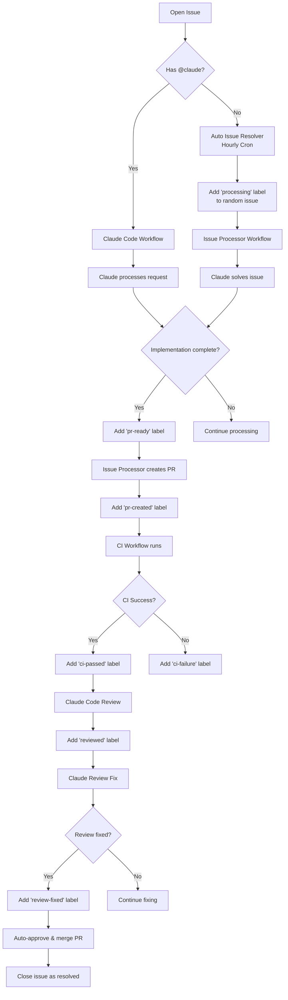
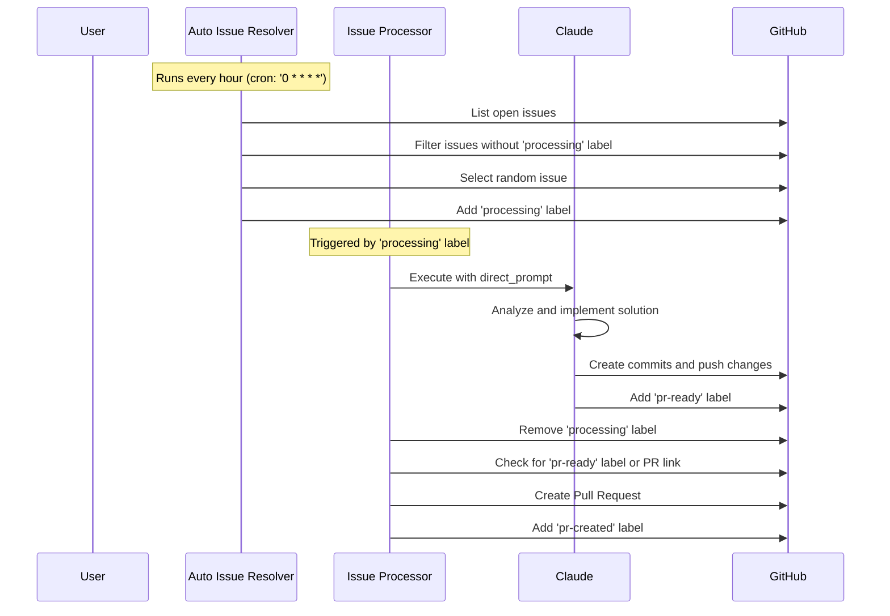
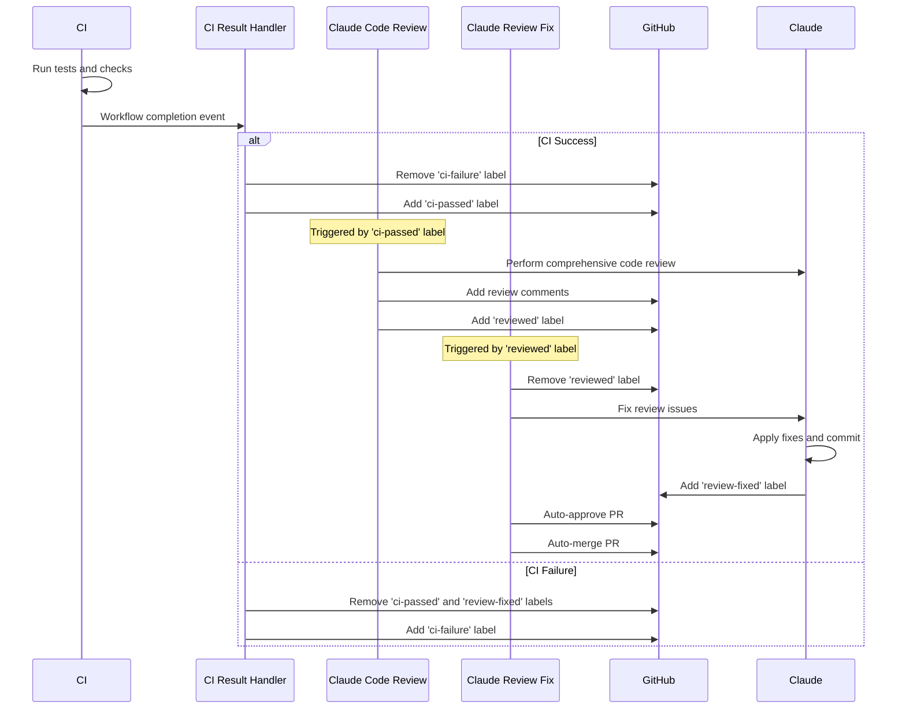
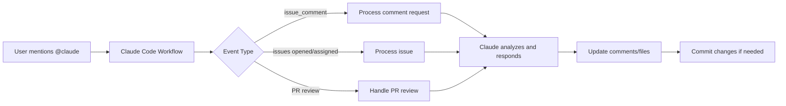
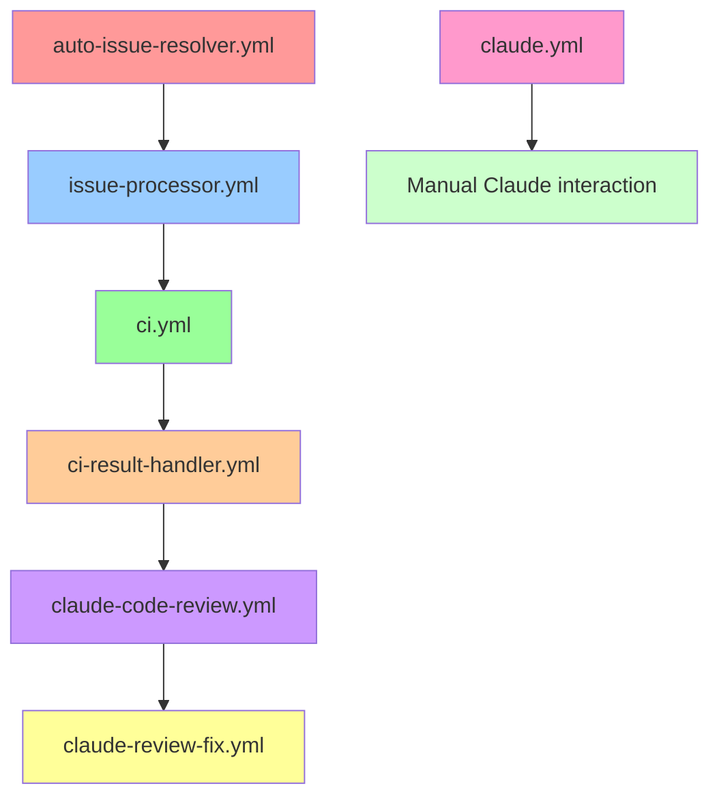

# Claude Code Auto Workflows

A comprehensive GitHub Actions workflow system that automates issue processing, code review, and pull request management using Claude Code.

## Table of Contents
- [Workflow Overview](#workflow-overview)
- [Detailed Workflow Processes](#detailed-workflow-processes)
- [Setup Instructions](#setup-instructions)
- [Required Labels](#required-labels)
- [Required Permissions](#required-permissions)
- [GitHub App Configuration](#github-app-configuration)
- [Personal Access Token Configuration](#personal-access-token-configuration)
- [Workflow Files](#workflow-files)

## Workflow Overview

This repository implements an automated development workflow that processes issues, creates pull requests, runs CI checks, performs code reviews, and auto-merges approved changes.



## Detailed Workflow Processes

### 1. Issue Processing Flow



### 2. Code Review and Merge Flow



### 3. Manual Claude Interaction Flow



## Setup Instructions

### Quick Setup Sequence
1. Install Claude Code CLI
2. Run `/install-github-app` and install Claude Code Actions
3. Create and install GitHub App with required permissions
4. Set `APP_ID` and `APP_PRIVATE_KEY` in repository secrets
5. Create Personal Access Token with required permissions
6. Add PAT as `PERSONAL_ACCESS_TOKEN` in repository secrets
7. Add `CLAUDE_CODE_OAUTH_TOKEN` to repository secrets
8. Create all required labels in your repository

## Required Labels

The system uses the following labels to track workflow state:

### Issue Processing Labels
| Label | Purpose | Added By |
|-------|---------|----------|
| `processing` | Issue is being processed by Claude | auto-issue-resolver.yml |
| `pr-ready` | Implementation complete, ready for PR creation | Claude Code |
| `pr-created` | PR has been created for this issue | issue-processor.yml |
| `resolved` | Issue has been resolved and closed | Manual/Auto |

### PR Review Labels
| Label | Purpose | Added By |
|-------|---------|----------|
| `reviewed` | PR has been reviewed and needs fixes | claude-code-review.yml |
| `review-fixed` | PR fixes completed, ready for merge | claude-review-fix.yml |

### CI/CD Status Labels
| Label | Purpose | Added By |
|-------|---------|----------|
| `ci-failure` | CI checks have failed | ci-result-handler.yml |
| `ci-passed` | CI checks have passed | ci-result-handler.yml |

### Label Creation Command
```bash
# Create all required labels at once
gh label create "processing" --color "FFA500" --description "Issue is being processed by Claude"
gh label create "pr-ready" --color "0052CC" --description "Implementation complete, ready for PR creation"
gh label create "pr-created" --color "0E8A16" --description "PR has been created for this issue"
gh label create "resolved" --color "6F42C1" --description "Issue has been resolved and closed"
gh label create "reviewed" --color "D93F0B" --description "PR has been reviewed and needs fixes"
gh label create "review-fixed" --color "0052CC" --description "PR fixes completed, ready for merge"
gh label create "ci-failure" --color "D93F0B" --description "CI checks have failed"
gh label create "ci-passed" --color "0E8A16" --description "CI checks have passed"
```

## Required Permissions

### GitHub App Permissions
The GitHub App requires the following permissions:

#### Repository Permissions
- **Contents**: `write` - Read and write repository contents
- **Issues**: `write` - Create, edit, and manage issues
- **Pull Requests**: `write` - Create, edit, and manage pull requests
- **Actions**: `read` - Read workflow run results for CI status
- **Metadata**: `read` - Read repository metadata

#### Account Permissions
- **Email addresses**: `read` - Access user email for commits

### Workflow Permissions
Each workflow requires specific permissions:

```yaml
permissions:
  contents: write        # For code changes and commits
  issues: write         # For issue management and labeling
  pull-requests: write  # For PR creation and management
  actions: read         # For reading CI results
  id-token: write       # For authentication
```

## GitHub App Configuration

### 1. Create GitHub App
1. Go to GitHub Settings > Developer Settings > GitHub Apps
2. Click "New GitHub App"
3. Fill in the app details:
   - **App name**: `claude-code-automation` (or your preferred name)
   - **Homepage URL**: Your repository URL
   - **Webhook URL**: Leave blank (not needed for this setup)

### 2. Set Permissions
Configure the following permissions:

#### Repository permissions:
- Contents: Read and write
- Issues: Read and write
- Pull requests: Read and write
- Actions: Read
- Metadata: Read

#### Subscribe to events:
- Issues
- Pull requests
- Push

### 3. Generate Private Key
1. Scroll down to "Private keys" section
2. Click "Generate a private key"
3. Download the `.pem` file

### 4. Install App
1. Go to "Install App" tab
2. Install on your account/organization
3. Select repositories or choose "All repositories"

### 5. Get App ID
- Find your App ID on the app settings page

## Personal Access Token Configuration

### Required Scopes
Create a Personal Access Token with the following scopes:

- `repo` (Full control of private repositories)
  - `repo:status` - Access commit status
  - `repo_deployment` - Access deployment status
  - `public_repo` - Access public repositories
- `workflow` - Update GitHub Action workflows
- `write:packages` - Upload packages to GitHub Package Registry
- `read:packages` - Download packages from GitHub Package Registry

### Token Creation Steps
1. Go to GitHub Settings > Developer Settings > Personal Access Tokens > Tokens (classic)
2. Click "Generate new token (classic)"
3. Select the required scopes listed above
4. Set expiration (recommend 90 days or no expiration for automation)
5. Generate token and copy it immediately

## Repository Secrets Configuration

Add the following secrets to your repository:

| Secret Name | Value | Description |
|-------------|-------|-------------|
| `APP_ID` | Your GitHub App ID | Found on GitHub App settings page |
| `APP_PRIVATE_KEY` | Contents of downloaded `.pem` file | GitHub App private key |
| `PERSONAL_ACCESS_TOKEN` | Your PAT | Personal Access Token with required scopes |
| `CLAUDE_CODE_OAUTH_TOKEN` | Your Claude Code OAuth token | Obtained from Claude Code CLI |

### Setting Secrets
```bash
# Using GitHub CLI
gh secret set APP_ID --body "123456"
gh secret set APP_PRIVATE_KEY --body "$(cat path/to/your-app.pem)"
gh secret set PERSONAL_ACCESS_TOKEN --body "ghp_your_token_here"
gh secret set CLAUDE_CODE_OAUTH_TOKEN --body "your_claude_oauth_token"
```

## Workflow Files

### Core Workflows

| File | Purpose | Trigger |
|------|---------|---------|
| `.github/workflows/auto-issue-resolver.yml` | Automatically adds 'processing' label to random issues | Cron (hourly) |
| `.github/workflows/issue-processor.yml` | Processes issues with Claude and creates PRs | Label: 'processing' |
| `.github/workflows/claude.yml` | Main Claude Code integration | @claude mentions |
| `.github/workflows/ci.yml` | Continuous Integration | PR events |
| `.github/workflows/ci-result-handler.yml` | Handles CI results and updates labels | CI workflow completion |
| `.github/workflows/claude-code-review.yml` | Automated code review | Label: 'ci-passed' |
| `.github/workflows/claude-review-fix.yml` | Handles review fixes and auto-merge | Label: 'reviewed' |

### Workflow Dependencies



## Important Notes

### anthropics/claude-code-action@beta Limitations
When using `anthropics/claude-code-action@beta`, the following are not supported:
- `workflow_run` events
- `repository_dispatch` events

These limitations only apply to the Claude Code Action. Regular `github-script` actions can still use these events.

### Auto-Generated Content Restrictions
Automatic comments, labels, and other content created by GitHub Actions workflows cannot trigger additional action workflows. Use Personal Access Token (PAT) for actions that need to trigger other workflows.