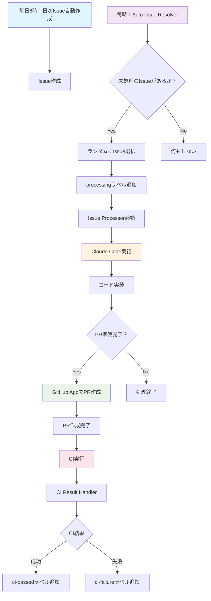

# Claude Code Actionsで実現する完全自動開発ワークフロー

## はじめに

この記事では、Anthropic社のClaude Code Actionsを使用して構築した完全自動開発ワークフローについて詳しく解説します。このワークフローでは、課題の発見から実装、テスト、プルリクエストの作成まで、すべてが自動化されています。

## ワークフロー全体図



## なぜ完全自動化が可能なのか

### 1. 段階的なワークフロー設計

完全自動化を実現するために、ワークフローを以下の段階に分割しています：

1. **Issue生成段階**: 日次でシステム改善タスクを自動作成
2. **Issue選択段階**: 時間毎にランダムなIssueを処理対象として選択
3. **実装段階**: Claude CodeがIssueを解析して実装
4. **PR作成段階**: 実装完了後に自動でプルリクエスト作成
5. **CI段階**: 自動テスト実行と結果の自動ハンドリング

### 2. 状態管理によるワークフロー制御

ラベルベースの状態管理により、各段階を適切に制御：

- `processing`: Issue処理中
- `pr-ready`: PR作成準備完了
- `pr-created`: PR作成済み
- `ci-passed`: CI成功
- `ci-failure`: CI失敗

## PAT（Personal Access Token）とGitHub Appの組み合わせ

### GitHub Actionsの無限ループ制限とその回避

GitHub Actionsには、自動生成されたイベント（comments、labelsなど）からは新しいワークフローをトリガーしないという制限があります。これは無限ループを防ぐためですが、完全自動化の妨げになります。

```yaml
# GitHub Tokenでは新しいワークフローがトリガーされない
github-token: ${{ secrets.GITHUB_TOKEN }}  # ❌ 制限される

# PATを使用することでワークフローがトリガーされる
github-token: ${{ secrets.PERSONAL_ACCESS_TOKEN }}  # ✅ トリガーされる
```

### PATとGitHub Appの使い分け

#### PATを使用する場面：
- **Auto Issue Resolver**: Issue選択とラベル追加
- **Daily Issue Creator**: 新しいIssue作成
- **CI Result Handler**: CI結果に基づくラベル更新

```yaml
# PATを使用してワークフローチェーンを継続
with:
  github-token: ${{ secrets.PERSONAL_ACCESS_TOKEN }}
```

#### GitHub Appを使用する場面：
- **PR作成**: セルフマージの制限を回避するため

```yaml
# GitHub Appトークンを生成してPR作成
- name: Generate GitHub App Token
  uses: actions/create-github-app-token@v2
  with:
    app-id: ${{ secrets.APP_ID }}
    private-key: ${{ secrets.APP_PRIVATE_KEY }}
```

## 核心技術: Issue Processorワークフロー

### 自動実装の仕組み

```yaml
- name: Run Claude Code for Issue Implementation
  uses: anthropics/claude-code-action@beta
  with:
    claude_code_oauth_token: ${{ secrets.CLAUDE_CODE_OAUTH_TOKEN }}
    direct_prompt: |
      このIssue #${{ github.event.issue.number }} を解決してください。
      実装が完了したら、pr-ready ラベルをこの Issue に追加してください
      
      **タイトル**: ${{ github.event.issue.title }}
      **説明**: ${{ github.event.issue.body || '説明なし' }}
```

### PR自動作成の仕組み

Claude Codeが実装完了時に生成するPRリンクを解析し、GitHub Appを使用して実際のPRを作成：

```yaml
# Claude CodeのコメントからPRリンクを抽出
const urlMatch = comment.body.match(/https:\/\/github\.com\/[^\/\s]+\/[^\/\s]+\/compare\/[^\s)]+/);

# GitHub AppでPR作成（セルフマージ制限を回避）
const pr = await github.rest.pulls.create({
  owner: context.repo.owner,
  repo: context.repo.repo,
  title: `Fix: ${issueTitle}`,
  body: `Fixes #${issueNumber}\n\nAuto-generated PR to resolve issue.`,
  head: head,
  base: base
});
```

## CI結果の自動ハンドリング

`workflow_run`イベントを使用してCI結果を監視し、自動でラベルを更新：

```yaml
on:
  workflow_run:
    workflows: ["CI"]
    types: [completed]

# CI結果に基づくラベル管理
if (conclusion === 'success') {
  // ci-passedラベル追加、ci-failureラベル削除
} else if (conclusion === 'failure') {
  // ci-failureラベル追加、ci-passedラベル削除
}
```

## 権限設定とセキュリティ考慮事項

### 必要な権限設定

#### Claude Code Action用:
```yaml
permissions:
  contents: read
  pull-requests: read
  issues: write
  id-token: write
  actions: read
```

#### Issue Processor用:
```yaml
permissions:
  contents: write      # ブランチ作成・コミット用
  pull-requests: write # PR作成用
  issues: write        # ラベル管理用
  id-token: write      # Claude Code認証用
  actions: read        # CI結果読み取り用
```

### GitHub App設定

PR作成専用のGitHub Appに必要な権限：
- **Contents**: Write（ブランチアクセス用）
- **Pull requests**: Write（PR作成用）
- **Issues**: Write（コメント・ラベル用）

### セキュリティ注意点

1. **PATの適切なスコープ設定**：
   - 必要最小限の権限のみ付与
   - 定期的なローテーション

2. **GitHub Appの制限**：
   - リポジトリスコープを特定のリポジトリに限定
   - Webhook URLの適切な設定

3. **機密情報の管理**：
   - Claude Code OAuth Token、PAT、GitHub App Private Keyは全てSecretsで管理
   - ログに機密情報が出力されないよう注意

## PRの自己マージ制限とその回避

### GitHub Actionsの制限

通常のGitHub Tokenを使用したPRは、同じワークフロー内でマージできません。これは以下の理由によるものです：

1. セキュリティ上の制限
2. 無限ループ防止
3. 人間による承認プロセスの強制

### GitHub Appによる解決

GitHub Appを使用することで、この制限を回避できます：

```yaml
# GitHub App Tokenを使用してPR作成
- name: Create Pull Request
  uses: actions/github-script@v7
  with:
    github-token: ${{ steps.app-token.outputs.token }}  # GitHub App Token
```

これにより、以下が可能になります：
- PRの自動作成
- 必要に応じた自動マージ（追加実装可能）
- コードレビュープロセスの自動化

## 実際の導入効果

### 開発速度の向上
- 手動での課題発見・実装時間の削減
- 24時間体制での継続的改善

### 品質の維持
- 一貫したコーディング規約の適用
- 自動テストによる品質保証

### 開発者の負荷軽減
- 繰り返し作業の自動化
- より創造的な作業への集中可能

## 今後の拡張可能性

1. **より高度なタスク生成**: AIによる課題分析と優先度付け
2. **動的テスト生成**: 実装内容に応じたテストケース自動生成
3. **レビュープロセス自動化**: AI によるコードレビューと自動承認
4. **デプロイメント自動化**: 本番環境への自動デプロイ

## まとめ

Claude Code Actionsを中心とした完全自動開発ワークフローは、以下の技術的要素の組み合わせにより実現されています：

1. **PAT/GitHub App の適切な使い分け**による制限回避
2. **段階的ワークフロー設計**による複雑なプロセスの自動化
3. **状態管理ベースの制御**による信頼性の確保
4. **適切な権限設定**によるセキュリティの維持

このアプローチにより、従来手動で行っていた開発プロセスの大部分を自動化し、より高品質で効率的な開発サイクルを実現できます。

---

*この記事で紹介したワークフローは、[GitHub リポジトリ](https://github.com/azumag/cca-auto-workflows)で実際に動作しています。*