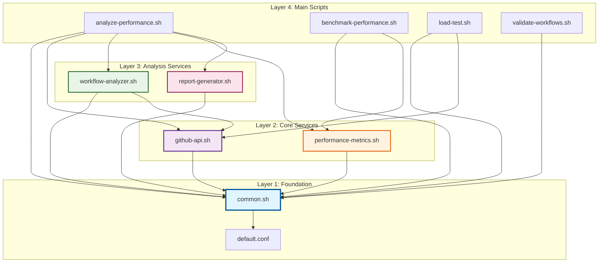
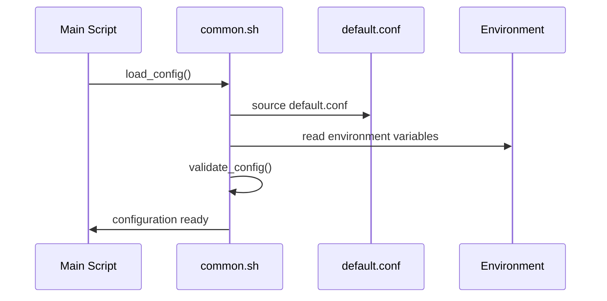
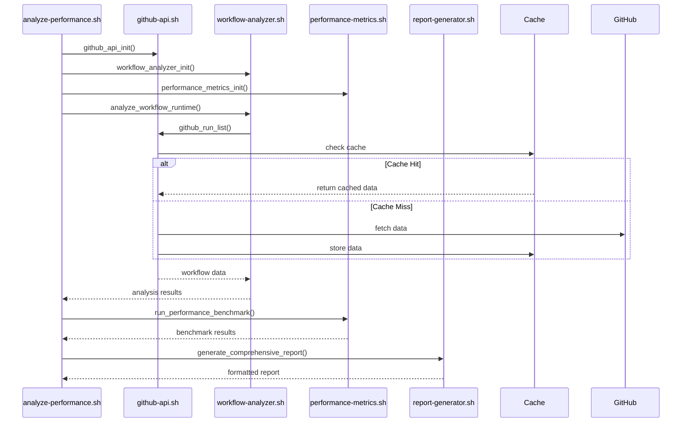
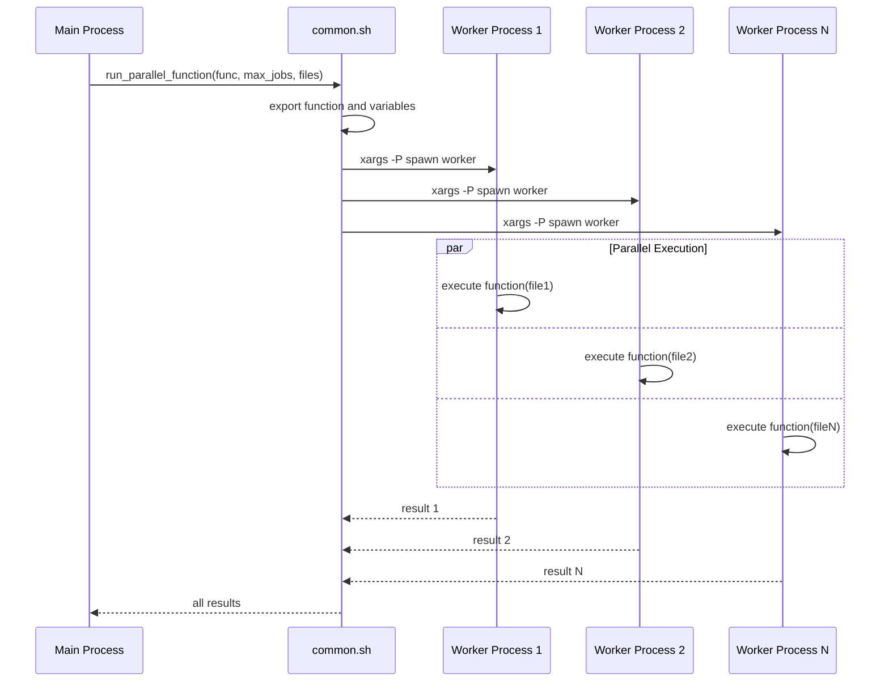
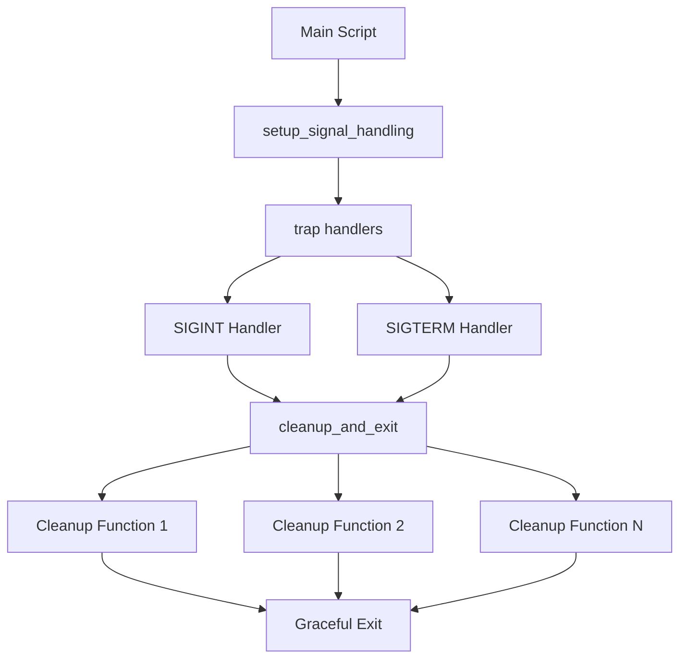

# Architecture Overview

This document provides a comprehensive overview of the Claude Code Auto Workflows system architecture, covering the modular design, component relationships, and key design patterns.

## Table of Contents

- [System Overview](#system-overview)
- [Modular Architecture](#modular-architecture)
- [Component Relationships](#component-relationships)
- [Design Patterns](#design-patterns)
- [Data Flow](#data-flow)
- [Error Handling & Cleanup](#error-handling--cleanup)
- [Performance Considerations](#performance-considerations)
- [Extension Points](#extension-points)

## System Overview

Claude Code Auto Workflows is a comprehensive GitHub Actions automation system that provides:

- **Automated Issue Processing**: Randomly selects and processes issues using Claude Code
- **Performance Analysis**: Comprehensive workflow and API usage analysis  
- **Code Review Automation**: Automated PR reviews and fixes
- **CI/CD Integration**: Seamless integration with GitHub Actions workflows
- **Performance Monitoring**: Real-time performance metrics and optimization suggestions

### High-Level Architecture

```mermaid
graph TB
    subgraph "External Systems"
        GH[GitHub API]
        GA[GitHub Actions]
        CC[Claude Code]
    end
    
    subgraph "Core System"
        subgraph "Main Scripts"
            APS[analyze-performance.sh]
            BPS[benchmark-performance.sh]
            LTS[load-test.s]
            VWS[validate-workflows.sh]
            COS[cleanup-old-runs.sh]
            CSS[check-secrets.sh]
            CLS[create-labels.sh]
        end
        
        subgraph "Library Modules"
            COM[common.sh]
            API[github-api.sh]
            WA[workflow-analyzer.sh]
            PM[performance-metrics.sh]
            RG[report-generator.sh]
        end
        
        subgraph "Configuration"
            DC[default.conf]
            ENV[Environment Variables]
        end
        
        subgraph "Automation Workflows"
            AIR[auto-issue-resolver.yml]
            IP[issue-processor.yml]
            CCR[claude-code-review.yml]
            CRF[claude-review-fix.yml]
            CIF[claude-ci-fix.yml]
            CIR[ci-result-handler.yml]
        end
    end
    
    subgraph "Data & Cache"
        CACHE[File-based Cache]
        LOGS[Performance Logs]
        REPORTS[Generated Reports]
    end
    
    %% External connections
    GH <--> API
    GA --> AIR
    GA --> IP
    CC <--> IP
    CC <--> CCR
    CC <--> CRF
    CC <--> CIF
    
    %% Internal connections
    APS --> COM
    APS --> API
    APS --> WA
    APS --> PM
    APS --> RG
    
    BPS --> COM
    BPS --> PM
    
    LTS --> COM
    LTS --> API
    
    VWS --> COM
    
    COS --> COM
    COS --> API
    
    COM --> DC
    COM --> ENV
    COM --> CACHE
    
    API --> CACHE
    PM --> LOGS
    RG --> REPORTS
    
    style COM fill:#e1f5fe
    style API fill:#f3e5f5
    style WA fill:#e8f5e8
    style PM fill:#fff3e0
    style RG fill:#fce4ec
```



## Modular Architecture

The system follows a **modular architecture** with clear separation of concerns and single responsibility principle.

### Core Library Module (`common.sh`)

The foundational module providing shared functionality across all scripts.

**Responsibilities:**
- Configuration loading and validation
- Signal handling and graceful shutdown
- Cache management (setup, validation, atomic operations)
- Parallel processing utilities
- Logging and progress display
- Error handling utilities

**Key Functions:**
```bash
load_config()              # Load and validate configuration
setup_signal_handling()    # Setup interrupt handlers
setup_cache()             # Initialize cache directory
get_cache_key()           # Generate cache keys
run_parallel_function()   # Execute functions in parallel
show_progress()           # Display progress indicators
```

### GitHub API Module (`github-api.sh`)

Centralized GitHub API interactions with caching and rate limiting.

**Responsibilities:**
- GitHub API authentication and calls
- Intelligent caching with TTL
- Rate limiting protection
- Performance metrics collection
- API call optimization

**Key Functions:**
```bash
github_api_init()         # Initialize API module
github_api_call()         # Make cached API calls
github_run_list()         # List workflow runs with caching
_check_rate_limit()       # Monitor API rate limits
```

**Caching Strategy:**
- 5-minute cache TTL for API responses
- SHA256-based cache keys
- Atomic cache operations to prevent race conditions
- Automatic cache cleanup

### Workflow Analyzer Module (`workflow-analyzer.sh`)

Workflow performance and efficiency analysis.

**Responsibilities:**
- Workflow runtime analysis
- Performance metrics calculation
- Configuration efficiency assessment
- Optimization recommendations

**Key Functions:**
```bash
analyze_workflow_runtime()     # Analyze execution times
analyze_workflow_efficiency()  # Assess configuration patterns
analyze_workflow_complexity()  # Calculate complexity metrics
```

**Analysis Capabilities:**
- Average execution times by workflow
- Success/failure rate analysis
- Performance trend identification
- Configuration pattern analysis (caching, conditionals, matrix builds)

### Performance Metrics Module (`performance-metrics.sh`)

Performance measurement and benchmarking infrastructure.

**Responsibilities:**
- Operation timing and measurement
- Benchmark execution
- Load testing coordination
- Metrics aggregation and reporting

**Key Functions:**
```bash
start_timer()                 # Begin timing operations
end_timer()                   # Complete timing operations
run_performance_benchmark()   # Execute benchmarks
run_load_test()              # Coordinate load tests
generate_performance_report() # Create performance summaries
```

### Report Generator Module (`report-generator.sh`)

Multi-format report generation and output formatting.

**Responsibilities:**
- Console output formatting
- JSON report generation
- Markdown report creation
- API usage summaries
- Optimization recommendations

**Key Functions:**
```bash
generate_api_usage_report()        # API usage analysis
generate_workflow_optimization()   # Optimization suggestions
generate_comprehensive_report()    # Full system reports
generate_json_report()            # Structured JSON output
```

**Output Formats:**
- **Console**: Colored, formatted terminal output
- **JSON**: Structured data for automation
- **Markdown**: Documentation-friendly reports

## Component Relationships

### Dependency Graph



### Module Interaction Patterns

#### 1. Initialization Pattern
```bash
# Each module follows consistent initialization
module_init() {
    log_info "Module initialized"
    # Setup module-specific resources
    # Register cleanup functions
}
```

#### 2. Configuration Inheritance
```bash
# Configuration flows from common.sh to all modules
source "$script_dir/lib/common.sh"
load_config "${CONFIG_FILE:-}"
# Configuration is now available to all modules
```

#### 3. Service Composition
```bash
# Main scripts compose services from multiple modules
source "$script_dir/lib/common.sh"
source "$script_dir/lib/github-api.sh"
source "$script_dir/lib/workflow-analyzer.sh"
source "$script_dir/lib/performance-metrics.sh"
source "$script_dir/lib/report-generator.sh"
```

## Design Patterns

### 1. Single Responsibility Principle

Each module has a clearly defined, single responsibility:

- **common.sh**: Shared utilities and infrastructure
- **github-api.sh**: GitHub API interactions only
- **workflow-analyzer.sh**: Workflow analysis only
- **performance-metrics.sh**: Performance measurement only
- **report-generator.sh**: Report generation only

### 2. Dependency Injection

Modules don't create their own dependencies; they receive them:

```bash
# Module receives cache directory rather than creating it
github_api_call() {
    local cache_key=$(get_cache_key "api_$endpoint")
    get_from_cache "$cache_key" "$GITHUB_API_CACHE_DIR" "$GITHUB_API_CACHE_TTL"
}
```

### 3. Template Method Pattern

Main scripts define the analysis workflow template:

```bash
main() {
    initialize_modules()
    run_analysis()
    generate_reports()
    cleanup()
}
```

### 4. Observer Pattern

Signal handling allows modules to register cleanup functions:

```bash
add_cleanup_function "module_cleanup"
setup_signal_handling()
```

### 5. Cache-Aside Pattern

Modules check cache first, then fetch and store:

```bash
github_api_call() {
    # Check cache first
    if get_from_cache "$cache_key" "$cache_dir" "$ttl"; then
        return 0
    fi
    
    # Fetch from API
    result=$(gh api "$endpoint")
    
    # Store in cache
    save_to_cache "$cache_key" "$result" "$cache_dir"
}
```

### 6. Strategy Pattern

Different output formats implemented as strategies:

```bash
case "$OUTPUT_FORMAT" in
    json)     generate_json_report ;;
    markdown) generate_markdown_report ;;
    console)  generate_console_report ;;
esac
```

## Data Flow

### 1. Configuration Flow



### 2. Analysis Flow



### 3. Parallel Processing Flow



## Error Handling & Cleanup

### 1. Signal Handling Architecture



### 2. Cleanup Function Registration

```bash
# Modules register cleanup functions
add_cleanup_function "github_api_cleanup"
add_cleanup_function "cache_cleanup"
add_cleanup_function "temp_file_cleanup"

# Functions executed in reverse order on exit
cleanup_and_exit() {
    for ((i=${#CLEANUP_FUNCTIONS[@]}-1; i>=0; i--)); do
        "${CLEANUP_FUNCTIONS[i]}"
    done
}
```

### 3. Error Propagation

```bash
# Consistent error handling across modules
function_with_error_handling() {
    local result
    if ! result=$(some_operation); then
        log_error "Operation failed"
        return 1
    fi
    echo "$result"
}
```

### 4. Atomic Operations

Cache operations are atomic to prevent corruption:

```bash
save_to_cache() {
    local temp_file
    temp_file=$(mktemp "${cache_file}.tmp.XXXXXX")
    
    if echo "$data" > "$temp_file" && mv "$temp_file" "$cache_file"; then
        return 0
    else
        rm -f "$temp_file"
        return 1
    fi
}
```

## Performance Considerations

### 1. Caching Strategy

- **Multi-level caching**: API responses, analysis results, computed metrics
- **Intelligent TTL**: 5 minutes for API data, 30 minutes for analysis results
- **Cache invalidation**: Automatic cleanup based on TTL and manual cleanup
- **Atomic operations**: Prevent cache corruption during concurrent access

### 2. Parallel Processing

- **Configurable parallelism**: `MAX_PARALLEL_JOBS` and `XARGS_PARALLEL_JOBS`
- **Efficient worker spawning**: Use `xargs -P` for optimal process management
- **Resource management**: Limit concurrent operations to prevent system overload

### 3. Rate Limiting

- **Proactive rate limit checking**: Check before making API calls
- **Buffer management**: Keep buffer of unused requests
- **Graceful degradation**: Fall back to cached data when rate limited

### 4. Memory Management

- **Streaming processing**: Process large datasets without loading into memory
- **Temporary file cleanup**: Automatic cleanup of temporary files
- **Cache size limits**: Automatic cleanup of old cache entries

## Extension Points

### 1. Adding New Analysis Modules

```bash
# Create new module: scripts/lib/custom-analyzer.sh
source "$script_dir/common.sh"

custom_analyzer_init() {
    log_info "Custom analyzer initialized"
}

analyze_custom_metrics() {
    # Custom analysis logic
}

# Export functions for use by main scripts
export -f custom_analyzer_init analyze_custom_metrics
```

### 2. Adding New Output Formats

```bash
# Extend report-generator.sh
generate_xml_report() {
    local output_file="$1"
    # XML generation logic
}

# Add to format selection
case "$OUTPUT_FORMAT" in
    xml) generate_xml_report "$OUTPUT_FILE" ;;
esac
```

### 3. Adding New Configuration Options

```bash
# Add to default.conf
NEW_FEATURE_ENABLED=false
NEW_FEATURE_TIMEOUT=300

# Add validation to common.sh
validate_config() {
    case "$NEW_FEATURE_ENABLED" in
        true|false) ;;
        *) log_error "Invalid NEW_FEATURE_ENABLED"; return 1 ;;
    esac
}
```

### 4. Custom Benchmarks

```bash
# Add to benchmark-performance.sh
benchmark_custom_operation() {
    run_performance_benchmark "custom_operation" "
        # Custom benchmark code
    "
}
```

This modular architecture provides a solid foundation for the GitHub Actions workflow automation system, with clear separation of concerns, robust error handling, and excellent extensibility for future enhancements.