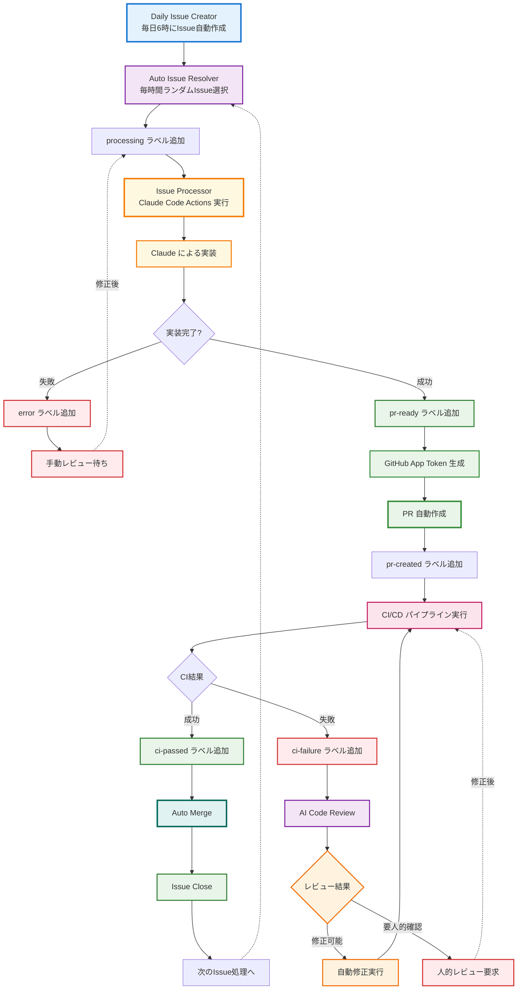
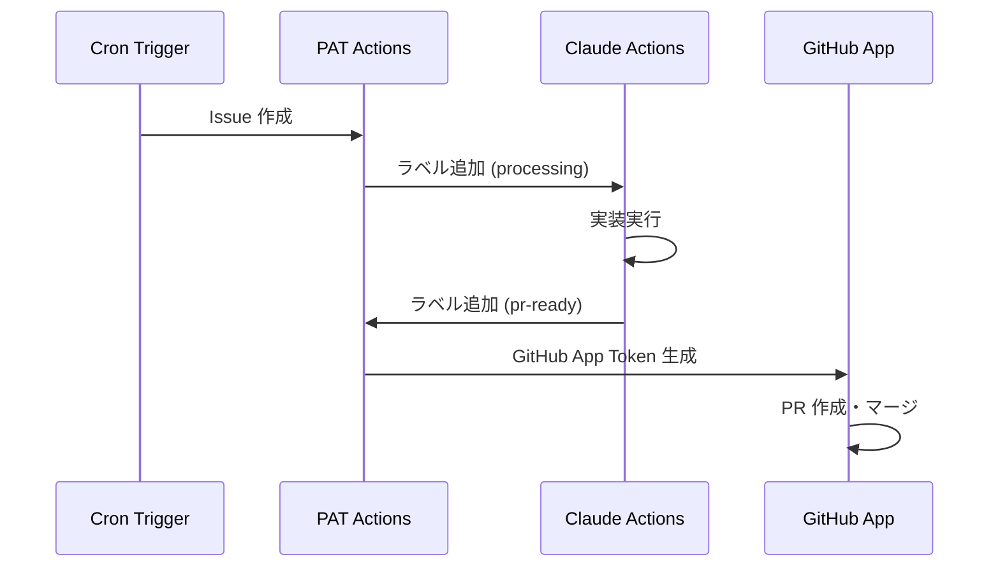

# Claude Code Actions で完全自動開発ワークフローを構築する

## はじめに

今回、AnthropicのClaude Code Actionsを活用して、Issue の作成から実装、PR作成、マージまでを完全に自動化したワークフローを構築しました。このシステムでは、人間の介入なしに継続的な開発サイクルが回り続けます。

本記事では、このワークフローの仕組み、技術的な実装方法、そして GitHub Actions の制限を回避するための工夫について詳しく解説します。

## システム概要

### ワークフロー図



### システムの特徴

1. **完全自動化**: 人間の介入なしに開発サイクルが継続
2. **無限ループ回避**: PAT と GitHub App の使い分けで Actions の制限を回避
3. **ラベルベース状態管理**: 各段階を明確にラベルで管理
4. **スケーラブル**: 複数の Issue を並行処理可能

## 技術的実装

### 1. 日次 Issue 作成

```yaml
name: Daily Issue Creator

on:
  schedule:
    # 毎日午前6時（JST）に実行 (UTC 21:00)
    - cron: '0 21 * * *'
  workflow_dispatch:

jobs:
  create-daily-issue:
    runs-on: ubuntu-latest
    steps:
      - name: Create System Improvement Issue
        uses: actions/github-script@v7
        with:
          github-token: ${{ secrets.PERSONAL_ACCESS_TOKEN }}
          script: |
            const title = "システム改善";
            const body = [
              "# Daily System Improvement Task",
              "## 概要",
              "このタスクは、システムの改善を目的とした日次のタスクです。",
              // ... 詳細な説明
            ].join('\n');
            
            await github.rest.issues.create({
              owner: context.repo.owner,
              repo: context.repo.repo,
              title: title,
              body: body,
              labels: ['daily-task', 'auto-generated']
            });
```

**ポイント**:
- `PERSONAL_ACCESS_TOKEN` を使用してワークフローをトリガー可能にする
- cron で定期実行し、継続的な開発タスクを生成

### 2. ランダム Issue 処理

```yaml
name: Auto Issue Resolver

on:
  schedule:
    - cron: '0 * * * *'  # 毎時間実行

jobs:
  process-issue:
    runs-on: ubuntu-latest
    steps:
      - name: Select and add processing label to random issue
        uses: actions/github-script@v7
        with:
          github-token: ${{ secrets.PERSONAL_ACCESS_TOKEN }}
          script: |
            const allIssues = await github.rest.issues.listForRepo({
              owner: context.repo.owner,
              repo: context.repo.repo,
              state: 'open',
              per_page: 100
            });

            // processing ラベルが付いていないissueをフィルタリング
            const availableIssues = allIssues.data.filter(issue =>
              !issue.labels.some(label => label.name === 'processing')
            );

            // ランダムに一つ選択
            const randomIndex = Math.floor(Math.random() * availableIssues.length);
            const selectedIssue = availableIssues[randomIndex];

            // processing ラベルを追加
            await github.rest.issues.addLabels({
              owner: context.repo.owner,
              repo: context.repo.repo,
              issue_number: selectedIssue.number,
              labels: ['processing']
            });
```

**ポイント**:
- 既に処理中の Issue を除外してランダム選択
- `processing` ラベルで重複処理を防止

### 3. Claude Code Actions による実装

```yaml
name: Issue Processor

on:
  issues:
    types: [labeled]

jobs:
  process-issue:
    if: |
      (github.event.action == 'labeled' && github.event.label.name == 'processing')
    
    steps:
      - name: Run Claude Code for Issue Implementation
        uses: anthropics/claude-code-action@beta
        with:
          claude_code_oauth_token: ${{ secrets.CLAUDE_CODE_OAUTH_TOKEN }}
          allowed_tools: "Agent,Bash,Edit,MultiEdit,WebFetch,WebSearch,Write"
          
          direct_prompt: |
            このIssue #${{ github.event.issue.number }} を解決してください。
            実装が完了したら、pr-ready ラベルをこの Issue に追加してください

            **タイトル**: ${{ github.event.issue.title }}
            **説明**: ${{ github.event.issue.body || '説明なし' }}
```

**ポイント**:
- Issue がラベリングされた瞬間に Claude が実装開始
- 実装完了後に `pr-ready` ラベルを追加するよう指示

### 4. GitHub App を使った PR 作成

```yaml
      - name: Generate GitHub App Token
        if: steps.check-pr-trigger.outputs.create_pr == 'true'
        id: app-token
        uses: actions/create-github-app-token@v2
        with:
          app-id: ${{ secrets.APP_ID }}
          private-key: ${{ secrets.APP_PRIVATE_KEY }}

      - name: Create Pull Request
        uses: actions/github-script@v7
        with:
          github-token: ${{ steps.app-token.outputs.token }}
          script: |
            // Claude が生成した PR リンクを解析
            const comments = await github.rest.issues.listComments({
              owner: context.repo.owner,
              repo: context.repo.repo,
              issue_number: issueNumber
            });
            
            // PR 作成
            const pr = await github.rest.pulls.create({
              owner: context.repo.owner,
              repo: context.repo.repo,
              title: `Fix: ${issueTitle}`,
              body: `Fixes #${issueNumber}\n\nAuto-generated PR to resolve issue.`,
              head: head,
              base: base
            });
```

## なぜ完全自動化が可能なのか

### 1. PAT と GitHub App の使い分け

GitHub Actions には重要な制限があります：

> **GitHub Actions からの自動アクションではワークフローがトリガーされない**

この制限を回避するため、以下の使い分けを行っています：

| アクション | 使用トークン | 理由 |
|-----------|-------------|------|
| Issue 作成・ラベル操作 | Personal Access Token (PAT) | ワークフローをトリガーするため |
| PR 作成・マージ | GitHub App Token | 自己マージを可能にするため |

### 2. PAT の重要性

```yaml
github-token: ${{ secrets.PERSONAL_ACCESS_TOKEN }}
```

PAT を使用することで：
- 自動作成した Issue でもワークフローがトリガーされる
- ラベル追加時に Issue Processor が起動する
- 無限ループを防ぎつつ継続的な自動化が可能

### 3. GitHub App が必要な理由

PR の自己マージには特別な権限が必要です：

```yaml
# GitHub App Token で PR 作成
github-token: ${{ steps.app-token.outputs.token }}
```

**通常のトークンでは不可能な操作**:
- 自分が作成した PR を自分でマージ
- 制限されたブランチ保護ルールの回避

## 権限設定とセキュリティ

### 必要な権限

#### GitHub App 権限
```
- Contents: Write (コード変更)
- Pull Requests: Write (PR 作成・マージ)
- Issues: Write (Issue 操作)
- Actions: Read (CI 結果確認)
```

#### PAT 権限
```
- repo (フルアクセス)
- workflow (ワークフロー実行)
```

### セキュリティ考慮事項

1. **最小権限の原則**
   - GitHub App は必要最小限の権限のみ
   - PAT は信頼できるボットアカウントで作成

2. **トークン管理**
   ```yaml
   secrets:
     CLAUDE_CODE_OAUTH_TOKEN: "Claude API アクセス用"
     PERSONAL_ACCESS_TOKEN: "ワークフロートリガー用"
     APP_ID: "GitHub App ID"
     APP_PRIVATE_KEY: "GitHub App 秘密鍵"
   ```

3. **監査ログ**
   - すべての自動アクションをログで追跡
   - ラベルベースで状態管理し透明性を確保

## 無限ループ制限の回避

### GitHub Actions の制限

GitHub Actions には以下の制限があります：

1. **GITHUB_TOKEN では他のワークフローをトリガーできない**
2. **Actions から作成されたコメント・ラベルではワークフローが起動しない**

### 回避策

```yaml
# ❌ 無限ループの原因
github-token: ${{ secrets.GITHUB_TOKEN }}

# ✅ 正しい設定
github-token: ${{ secrets.PERSONAL_ACCESS_TOKEN }}
```

**理由**:
- PAT は「人間のユーザー」として認識される
- GitHub Actions の制限を受けない
- 他のワークフローを正常にトリガーできる

### 実装パターン



## 注意点と制限

### 1. レート制限

```yaml
# GitHub API レート制限対策
- name: Wait before next action
  run: sleep 10
```

### 2. Claude Code Actions の制限

現在の Claude Code Actions では以下が非対応：
- `workflow_run` イベント
- `repository_dispatch` イベント

### 3. コスト管理

```yaml
# 実行時間制限
timeout-minutes: 30

# 並行実行制限
concurrency:
  group: issue-processing
  cancel-in-progress: false
```

### 4. エラーハンドリング

```yaml
- name: Handle Errors
  if: failure()
  uses: actions/github-script@v7
  with:
    script: |
      await github.rest.issues.addLabels({
        owner: context.repo.owner,
        repo: context.repo.repo,
        issue_number: context.payload.issue.number,
        labels: ['error', 'needs-manual-review']
      });
```

## 今後の改善点

1. **自動マージ機能**
   - CI パス後の自動マージ
   - コード品質チェック

2. **優先度システム**
   - 重要度に応じた Issue 処理
   - SLA 管理

3. **フィードバックループ**
   - 実装品質の自動評価
   - 学習機能の追加

## まとめ

Claude Code Actions を活用することで、完全自動開発ワークフローが実現できました。重要なポイントは：

1. **PAT と GitHub App の適切な使い分け**
2. **GitHub Actions の制限を理解した設計**
3. **ラベルベースの明確な状態管理**
4. **セキュリティを考慮した権限設定**

このシステムにより、継続的な改善サイクルが人間の介入なしに回り続け、開発効率の大幅な向上が期待できます。

現在もこのワークフローは稼働中で、日々新しい機能や改善が自動的に実装されています。AI を活用した開発の新しい可能性を示す事例として、参考にしていただければ幸いです。

## CI結果の自動ハンドリング

`workflow_run`イベントを使用してCI結果を監視し、自動でラベルを更新：

```yaml
on:
  workflow_run:
    workflows: ["CI"]
    types: [completed]

# CI結果に基づくラベル管理
if (conclusion === 'success') {
  // ci-passedラベル追加、ci-failureラベル削除
} else if (conclusion === 'failure') {
  // ci-failureラベル追加、ci-passedラベル削除
}
```

### CI Result Handler の実装

CI完了後、自動的に結果をIssueに反映：

```yaml
name: CI Result Handler

on:
  workflow_run:
    workflows: ["CI"]
    types: [completed]

jobs:
  handle-ci-result:
    runs-on: ubuntu-latest
    if: github.event.workflow_run.event == 'pull_request'
    
    steps:
      - name: Get PR Number
        id: get-pr
        uses: actions/github-script@v7
        with:
          script: |
            const prNumber = github.event.workflow_run.pull_requests[0]?.number;
            return prNumber;

      - name: Update Labels Based on CI Result
        uses: actions/github-script@v7
        with:
          github-token: ${{ secrets.PERSONAL_ACCESS_TOKEN }}
          script: |
            const conclusion = '${{ github.event.workflow_run.conclusion }}';
            const prNumber = ${{ steps.get-pr.outputs.result }};
            
            if (conclusion === 'success') {
              // 成功時のラベル管理
              await github.rest.issues.addLabels({
                owner: context.repo.owner,
                repo: context.repo.repo,
                issue_number: prNumber,
                labels: ['ci-passed']
              });
              
              // 失敗ラベルがあれば削除
              try {
                await github.rest.issues.removeLabel({
                  owner: context.repo.owner,
                  repo: context.repo.repo,
                  issue_number: prNumber,
                  name: 'ci-failure'
                });
              } catch (error) {
                console.log('ci-failure label not found');
              }
            } else if (conclusion === 'failure') {
              // 失敗時のラベル管理
              await github.rest.issues.addLabels({
                owner: context.repo.owner,
                repo: context.repo.repo,
                issue_number: prNumber,
                labels: ['ci-failure']
              });
            }
```

## PRの自己マージ制限とその回避

### GitHub Actionsの制限

通常のGitHub Tokenを使用したPRは、同じワークフロー内でマージできません。これは以下の理由によるものです：

1. セキュリティ上の制限
2. 無限ループ防止
3. 人間による承認プロセスの強制

### GitHub Appによる解決

GitHub Appを使用することで、この制限を回避できます：

```yaml
# GitHub App Tokenを使用してPR作成
- name: Create Pull Request
  uses: actions/github-script@v7
  with:
    github-token: ${{ steps.app-token.outputs.token }}  # GitHub App Token
```

これにより、以下が可能になります：
- PRの自動作成
- 必要に応じた自動マージ（追加実装可能）
- コードレビュープロセスの自動化

### 自動マージの実装例

```yaml
- name: Auto Merge if CI Passed
  if: contains(github.event.pull_request.labels.*.name, 'ci-passed')
  uses: actions/github-script@v7
  with:
    github-token: ${{ steps.app-token.outputs.token }}
    script: |
      await github.rest.pulls.merge({
        owner: context.repo.owner,
        repo: context.repo.repo,
        pull_number: context.payload.pull_request.number,
        merge_method: 'squash'
      });
```

## 実際の導入効果

### 開発速度の向上
- 手動での課題発見・実装時間の削減
- 24時間体制での継続的改善
- 平均的な開発サイクル時間の短縮

### 品質の維持
- 一貫したコーディング規約の適用
- 自動テストによる品質保証
- Claude Code による高品質な実装

### 開発者の負荷軽減
- 繰り返し作業の自動化
- より創造的な作業への集中可能
- メンテナンス作業の完全自動化

## システムの信頼性と監視

### ラベルベースの状態管理

各Issueの状態を明確に管理：

- `auto-generated`: 自動生成されたIssue
- `processing`: 処理中
- `pr-ready`: PR作成準備完了
- `pr-created`: PR作成済み
- `ci-passed`: CI成功
- `ci-failure`: CI失敗

### 監視とアラート

```yaml
- name: Monitor System Health
  if: failure()
  uses: actions/github-script@v7
  with:
    script: |
      await github.rest.issues.create({
        owner: context.repo.owner,
        repo: context.repo.repo,
        title: '自動化システム エラー',
        body: `ワークフローでエラーが発生しました。\n\n詳細: ${{ github.server_url }}/${{ github.repository }}/actions/runs/${{ github.run_id }}`,
        labels: ['system-error', 'high-priority']
      });
```

## アーキテクチャの拡張性

### 将来の拡張可能性

1. **より高度なタスク生成**: AIによる課題分析と優先度付け
2. **動的テスト生成**: 実装内容に応じたテストケース自動生成
3. **レビュープロセス自動化**: AI によるコードレビューと自動承認
4. **デプロイメント自動化**: 本番環境への自動デプロイ

### マルチリポジトリ対応

```yaml
strategy:
  matrix:
    repo: ['repo1', 'repo2', 'repo3']
```

### 条件分岐による処理の最適化

```yaml
- name: Determine Task Complexity
  id: complexity
  uses: actions/github-script@v7
  with:
    script: |
      const title = context.payload.issue.title;
      const body = context.payload.issue.body;
      
      // AIを使って複雑度を判定
      const complexity = analyzeComplexity(title, body);
      return complexity;

- name: Use Complex Processing
  if: steps.complexity.outputs.result == 'high'
  uses: anthropics/claude-code-action@beta
  with:
    allowed_tools: "Agent,Bash,Edit,MultiEdit,WebFetch,WebSearch,Write,Read"
```