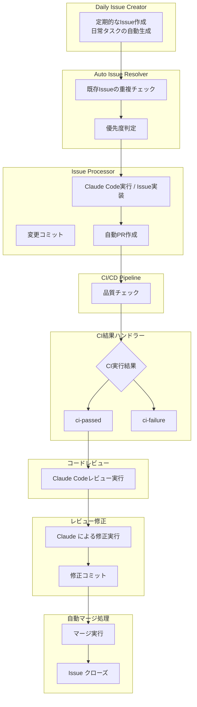
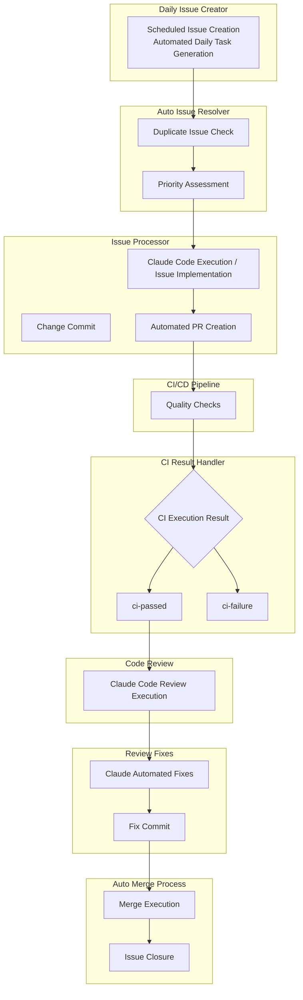

# Claude CodeとGitHub Actionsを活用した完全自動化ワークフローシステム

## はじめに

この記事では、Claude CodeとGitHub Actionsを組み合わせてIssueからPRまでを完全自動化するワークフローシステムについて詳しく解説します。

このシステムの主な機能は以下の通りです：

- 日常的なIssue作成
- Claude Codeによる実装
- 自動PR作成
- CI/CD結果処理
- コードレビュー
- 自動マージ

## システム概要

### アーキテクチャ図



### English Architecture Overview



### ワークフロー構成要素

1. **Auto Issue Resolver**: 既存の類似Issueをチェック
2. **Issue Processor**: Claude CodeがIssueを解決してPR作成
3. **CI Result Handler**: CI/CD結果を自動処理
4. **Code Review**: Claude Codeによる包括的レビュー
5. **Review Fix**: レビュー指摘事項の自動修正
6. **Auto Merge**: 品質チェック通過後の自動マージ

## セットアップ手順

### 前提条件

#### 1. Claude Code CLI のセットアップ

```bash
npm install -g @anthropic-ai/claude-code
claude setup-token
```

#### 2. GitHub App の設定

必要な権限:
- **Repository permissions**:
  - Contents: Read and write
  - Issues: Read and write  
  - Pull requests: Read and write
  - Actions: Read
  - Metadata: Read

#### 3. Personal Access Token の作成

必要なスコープ:
- `repo` (Full control of private repositories)
- `workflow` (Update GitHub Action workflows)

#### 4. Repository Secrets の設定

| Secret | 説明 | 取得方法 |
|----------|-----|------|
| `APP_ID` | GitHub App ID | GitHub App設定から取得 |
| `APP_PRIVATE_KEY` | 秘密鍵 | 作成時にダウンロードされる`.pem`ファイルの内容 |
| `PERSONAL_ACCESS_TOKEN` | PAT | 作成したPersonal Access Token |
| `CLAUDE_CODE_OAUTH_TOKEN` | Claude OAuth Token | Claude Code CLI設定で取得 |

#### 5. 前提条件の検証

```bash
# GitHub認証状態の確認
gh auth status

# Secrets設定の確認
gh secret list

# Claude Code認証確認
claude config
```

#### 6. 必要なラベル作成

```bash
# プロジェクトで必要なラベルを作成
gh label create "processing" --color "FFA500" --description "Issue is being processed by Claude"
gh label create "pr-ready" --color "0052CC" --description "Implementation complete, ready for PR creation"
gh label create "pr-created" --color "0E8A16" --description "PR has been created for this issue"
gh label create "resolved" --color "6F42C1" --description "Issue has been resolved and closed"
gh label create "reviewed" --color "D93F0B" --description "PR has been reviewed and needs fixes"
gh label create "review-fixed" --color "0052CC" --description "PR fixes completed, ready for merge"
gh label create "ci-failure" --color "D93F0B" --description "CI checks have failed"
gh label create "ci-passed" --color "0E8A16" --description "CI checks have passed"
```

## ワークフロー設定詳細

### 1. Issue処理ワークフロー

```yaml
# .github/workflows/issue-processor.yml
name: Issue Processor

on:
  issues:
    types: [labeled]

jobs:
  process-issue:
    if: github.event.label.name == 'processing'
    runs-on: ubuntu-latest
    
    steps:
    - name: Checkout repository
      uses: actions/checkout@v4
      
    - name: Setup Node.js
      uses: actions/setup-node@v4
      with:
        node-version: '18'
        
    - name: Install Claude Code
      run: npm install -g @anthropic-ai/claude-code
      
    - name: Execute Claude Code
      run: |
        claude run --issue ${{ github.event.issue.number }} \
                   --repository ${{ github.repository }} \
                   --token ${{ secrets.CLAUDE_CODE_OAUTH_TOKEN }}
      env:
        GITHUB_TOKEN: ${{ secrets.GITHUB_TOKEN }}
        
    - name: Create Pull Request
      if: success()
      run: |
        gh pr create --title "Fix for issue #${{ github.event.issue.number }}" \
                     --body "Automated fix for issue #${{ github.event.issue.number }}" \
                     --label "pr-created"
```

**動作流れ**:
- `processing`ラベルが付与される
- Claude Codeが問題を実装
- `pr-ready`ラベル付与でPR作成が開始

### 2. CI結果ハンドラー

```yaml
# .github/workflows/ci-result-handler.yml  
name: CI Result Handler

on:
  workflow_run:
    workflows: ["CI"]
    types: [completed]

jobs:
  handle-ci-result:
    runs-on: ubuntu-latest
    
    steps:
    - name: Check CI Result
      id: ci-check
      run: |
        if [ "${{ github.event.workflow_run.conclusion }}" == "success" ]; then
          echo "result=success" >> $GITHUB_OUTPUT
        else
          echo "result=failure" >> $GITHUB_OUTPUT
        fi
        
    - name: Add success label
      if: steps.ci-check.outputs.result == 'success'
      run: |
        gh pr edit ${{ github.event.workflow_run.pull_requests[0].number }} \
           --add-label "ci-passed"
      env:
        GITHUB_TOKEN: ${{ secrets.GITHUB_TOKEN }}
        
    - name: Add failure label and request fixes
      if: steps.ci-check.outputs.result == 'failure'
      run: |
        gh pr edit ${{ github.event.workflow_run.pull_requests[0].number }} \
           --add-label "ci-failure"
```

**処理内容**:
- CI成功: `ci-passed`ラベル付与
- CI失敗: `ci-failure`ラベル付与し修正プロセス開始

### 3. コードレビューワークフロー

```yaml
# .github/workflows/claude-code-review.yml
name: Claude Code Review

on:
  pull_request:
    types: [labeled]

jobs:
  review:
    if: contains(github.event.pull_request.labels.*.name, 'ci-passed')
    runs-on: ubuntu-latest
    
    steps:
    - name: Checkout code
      uses: actions/checkout@v4
      
    - name: Setup Claude Code
      run: npm install -g @anthropic-ai/claude-code
      
    - name: Execute Code Review
      run: |
        claude review --pr ${{ github.event.pull_request.number }} \
                      --repository ${{ github.repository }} \
                      --comprehensive \
                      --security-check \
                      --performance-analysis
      env:
        CLAUDE_CODE_OAUTH_TOKEN: ${{ secrets.CLAUDE_CODE_OAUTH_TOKEN }}
        GITHUB_TOKEN: ${{ secrets.GITHUB_TOKEN }}
        
    - name: Add review label
      run: |
        gh pr edit ${{ github.event.pull_request.number }} \
           --add-label "reviewed"
```

**レビュー項目**:
- セキュリティ検査
- パフォーマンス分析
- コード品質チェック
- ベストプラクティス適合性

### 4. レビュー修正と自動マージ

```yaml
# .github/workflows/claude-review-fix.yml
name: Claude Review Fix

on:
  pull_request:
    types: [labeled]

jobs:
  fix-and-merge:
    if: contains(github.event.pull_request.labels.*.name, 'reviewed')
    runs-on: ubuntu-latest
    
    steps:
    - name: Checkout code
      uses: actions/checkout@v4
      with:
        token: ${{ secrets.PERSONAL_ACCESS_TOKEN }}
        
    - name: Apply Claude fixes
      run: |
        claude fix --pr ${{ github.event.pull_request.number }} \
                   --apply-suggestions \
                   --commit-changes
      env:
        CLAUDE_CODE_OAUTH_TOKEN: ${{ secrets.CLAUDE_CODE_OAUTH_TOKEN }}
        
    - name: Auto merge if ready
      if: success()
      run: |
        gh pr merge ${{ github.event.pull_request.number }} \
           --auto --squash
      env:
        GITHUB_TOKEN: ${{ secrets.PERSONAL_ACCESS_TOKEN }}
```

## ベストプラクティスガイド

### 1. Issue作成のガイドライン

効果的なIssue作成のためのベストプラクティス:

- **明確なタイトル**: 実装すべき機能や修正すべき問題を簡潔に
- **詳細な説明**: 期待する動作と現状
- **受入基準**: 完了条件を明確に定義

### 2. ラベル管理

適切なラベル管理でワークフローの効率性を向上:

| ラベル | 用途 | 自動付与タイミング |
|--------|------|-------------|
| `processing` | 処理中 | 手動またはBot |
| `ci-passed`/`ci-failure` | CI結果 | 自動 |
| `pr-ready` | PR準備完了 | Claude実装完了時 |

### 3. エラーハンドリング

堅牢なシステムのためのエラー処理:

- 失敗時の自動リトライ機能
- 失敗通知とアラート
- GitHub API レート制限対応
- Claude Code使用量監視

## パフォーマンス最適化

### ワークフロー実行時間の短縮

#### 1. 並列実行の活用

**問題**: 順次実行による時間増加

**解決策**:
```yaml
strategy:
  matrix:
    include:
      - task: "lint"
        node-version: "18"
      - task: "test"
        node-version: "18"
      - task: "build"
        node-version: "18"
  max-parallel: 3
```

#### 2. キャッシュの効果的利用

```yaml
- name: Cache dependencies
  uses: actions/cache@v4
  with:
    path: |
      ~/.npm
      node_modules
    key: ${{ runner.os }}-node-${{ hashFiles('**/package-lock.json') }}
    restore-keys: |
      ${{ runner.os }}-node-
```

#### 3. 条件分岐による無駄な実行の削減

```yaml
- name: Run tests
  if: contains(github.event.pull_request.changed_files, '**/*.js') || 
      contains(github.event.pull_request.changed_files, '**/*.ts')
  run: npm test
```

### GitHub API使用量の最適化

- バッチ処理による API呼び出し削減
- Webhook利用による ポーリング回数削減
- 適切なAPI レート制限ハンドリング

## セキュリティ考慮事項

### 1. 権限管理の最適化

- GitHub App権限の最小化
- Personal Access Tokenの定期ローテーション
- Secrets のスコープ制限

**推奨設定**:
```yaml
permissions:
  contents: read
  issues: write
  pull-requests: write
  actions: read
```

### 2. セキュリティ監査ログ

- 全自動操作のログ記録
- 異常検知とアラート
- アクセス履歴の定期レビュー

### 3. 機密情報の保護

- Secrets ローテーション手順の確立
- 環境変数における機密データの適切な管理
- 第三者アクセスの監視

**Secrets管理例**:
```bash
# 定期的なローテーション
gh secret set CLAUDE_CODE_OAUTH_TOKEN --body "$NEW_TOKEN"

# 使用状況の監視
gh api /repos/:owner/:repo/actions/secrets/usage
```

### 4. 脆弱性スキャンの統合

```yaml
- name: Security scan
  uses: github/codeql-action/analyze@v3
  with:
    languages: javascript, typescript
    
- name: Dependency check
  run: |
    npm audit --audit-level=high
    npm audit fix --force
```

## トラブルシューティング

### よくある問題と解決策

#### 1. 認証エラーの対処法

**問題**: 権限不足やトークン期限切れ

**診断手順**:
```bash
# GitHub認証状態の確認
gh auth status

# トークン権限の確認
gh api user

# Repository access確認
gh api /repos/:owner/:repo
```

**解決策**:
```bash
# 再認証
gh auth login

# トークン更新
claude setup-token
# 新しいトークンを Repository Secrets に設定
```

#### 2. Claude Code実行の失敗

**問題**: OAuth トークンの問題や使用量制限

**解決策**:
```bash
# 設定確認
claude config

# トークン再設定
claude setup-token

# 使用量確認
claude usage
```

#### 3. ラベル管理の問題

**問題**: 必要なラベルが存在しない

**解決策**:
```bash
# ラベル一覧確認
gh label list

# 不足ラベルの作成
gh label create "processing" --color "FFA500"
```

#### 4. ワークフロー実行権限

**問題**: workflow_run や repository_dispatch が動作しない

**説明**: anthropics/claude-code-action@beta では以下が非対応:
- workflow_run
- repository_dispatch

**回避策**: github-script アクションまたは PAT を使用

#### 5. CI/CD統合の問題

**問題**: CI結果の取得失敗

**診断**:
```bash
# ワークフロー実行状況確認
gh run list

# 特定のrun詳細
gh run view <run-id>
```

**解決策**: 権限設定とワークフロー設定の見直し

### デバッグの有効化

システムのトラブルシューティング時の詳細ログ取得:

```bash
# GitHub Actions デバッグログ有効化
gh secret set ACTIONS_STEP_DEBUG --body "true"
gh secret set ACTIONS_RUNNER_DEBUG --body "true"

# Claude Code詳細ログ
export CLAUDE_DEBUG=true
claude run --verbose
```

### システム監視とアラート

```yaml
# .github/workflows/system-health.yml
name: System Health Check

on:
  schedule:
    - cron: '0 */6 * * *'  # 6時間毎

jobs:
  health-check:
    runs-on: ubuntu-latest
    steps:
    - name: Check API Limits
      run: |
        REMAINING=$(gh api rate_limit --jq '.resources.core.remaining')
        if [ "$REMAINING" -lt 100 ]; then
          echo "API rate limit low: $REMAINING remaining"
          # Slack/Teams通知を送信
        fi
        
    - name: Check workflow failures
      run: |
        FAILURES=$(gh run list --status failure --limit 10 --json conclusion | jq length)
        if [ "$FAILURES" -gt 5 ]; then
          echo "High failure rate detected: $FAILURES failures"
          # アラート送信
        fi
```

## 運用とメンテナンス

### 定期メンテナンスタスク

#### 週次タスク
- [ ] ワークフロー実行状況のレビュー
- [ ] 失敗ログの分析と対策
- [ ] API使用量の確認

#### 月次タスク
- [ ] Secrets の有効期限確認
- [ ] セキュリティ設定の見直し
- [ ] パフォーマンス指標の分析

#### 四半期タスク
- [ ] システム全体のセキュリティ監査
- [ ] ワークフロー効率性の評価と改善
- [ ] 新機能や改善の検討

### 監視項目

| 指標 | 目標値 | アラート条件 |
|------|--------|--------------|
| ワークフロー成功率 | >95% | <90% |
| 平均処理時間 | <10分 | >15分 |
| API使用量 | <80% | >90% |
| Claude Code使用量 | 月次制限の<80% | >90% |

## まとめ

Claude CodeとGitHub Actionsの組み合わせによる完全自動化ワークフローシステムは、開発プロセスの大幅な効率化を実現します。このシステムにより:

- **自動化による効率性**: 手動作業の大幅削減
- **品質の向上**: 一貫したレビューと品質チェック
- **ベストプラクティスの強制**: 標準化されたプロセス

適切な設定と運用により、開発チームはより価値の高いタスクに集中でき、AI支援による次世代の開発環境を構築できます。継続的な改善と監視により、システムの価値を最大化していきましょう。

## 参考資料

- [Claude Code公式ドキュメント](https://docs.anthropic.com/en/docs/claude-code)
- [GitHub Actions 公式ドキュメント](https://docs.github.com/en/actions)
- [プロジェクトリポジトリ](https://github.com/azumag/cca-auto-workflows)

---

このシステムの導入により、開発チームはより革新的で価値のあるプロダクト開発に専念できるようになります。ご質問がございましたらお気軽にお問い合わせください。